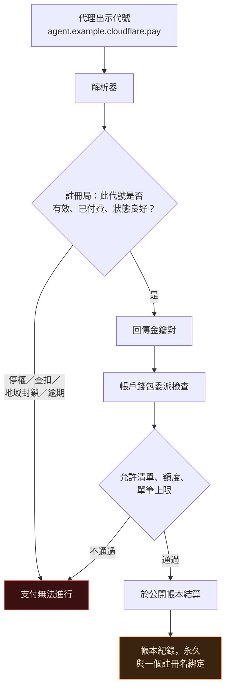
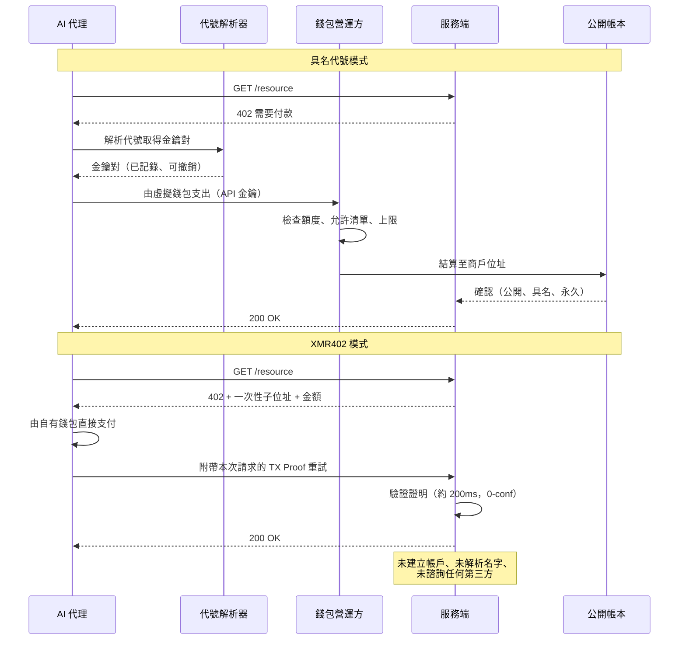

# 名字就是咽喉點：cloudflare.pay 為何給每個代理一個永久支付地址——而 XMR402 的代理選擇無名

> Cloudflare 的 Wallets 與 cloudflare.pay 給了 AI 代理支出上限，也給了更關鍵的東西：名字。可解析的支付代號是把透明帳本變成具名行為紀錄的連結鍵。XMR402 改用一次性位址——無可解析，亦無可撤銷。

- **Author:** @xbtoshi
- **Date:** 2026-09-05
- **Tags:** xmr402, monero, x402, cloudflare, cloudflare-wallets, cloudflare-pay, agent-identity, naming-layer, dns, handles, virtual-wallets, delegated-spend, stateless, tx-proof, fcmp, anonymity-set, agentic-payments, privacy, 0-conf, ripley-guard, censorship-resistance
- **Canonical:** https://xmr402.org/blog/cloudflare-pay-handles-agent-naming-layer-xmr402

---

# 名字就是咽喉點：cloudflare.pay 為何給每個代理一個永久支付地址——而 XMR402 的代理選擇無名

2026 年 8 月 4 日，Cloudflare 在其 Agents Week 期間發表了 Wallets 與 `cloudflare.pay`。多數報導的標題都是顯而易見的那一半：AI 代理現在可以持有資金，並在額度內花用。

而更關鍵的另一半是：代理被賦予了**名字**。

錢包是容器，名字是索引。在人類建造過的每一套網路系統中，控制權累積的位置從來不是儲存層或傳輸層，而是**命名層**。Cloudflare 比誰都清楚這一點——所以它為 `cloudflare.pay` 提出的類比正是 DNS：人類可讀的識別碼對應到密碼學金鑰對，就像網域名稱對應到 IP 位址。

這個類比完全正確。而這正是問題所在。

## 實際發布了什麼

拆解公告後，三件事已經落地，一件是提案，還有幾件被刻意留白。

已落地：**帳戶錢包（Account Wallet）**屬於人類並持有資金，它把有上限的支出權委派給代理透過 API 金鑰操作的**虛擬錢包（Virtual Wallet）**。委派帶有額度、已核准商戶的允許清單，以及單筆交易上限。

提案中：`cloudflare.pay` 代號——一個人類可讀的代理身分層，定位為代理身分標準尚未底定前的過渡方案。

留白：託管餘額的託管方、支援的穩定幣、結算網路。代號預約在發布當天開放，但入金、支出與商戶支援在 Cloudflare 自己的文案中仍是未來式。

公道話：有界限的委派確實優於它所取代的模式——一個餘額無上限的熱錢包，加上一把貼在代理環境變數裡的 API 金鑰。額度與單筆上限確實縮小了失控代理能造成的損害。以下的論點不否認這一點。

真正的爭議更窄，也更持久：支出控制是拿到新聞稿的那一半，命名層才是會改變網際網路的那一半。

## DNS 從來就不是中立的一層

認真對待這個類比，並一路推到底。

DNS 給了網際網路可用性，同時也給了它註冊局、註冊商、解析器、續約週期、TTL、濫用政策、停權程序，以及最終的法院查扣令與司法管轄封鎖清單。這些都不在原始設計文件裡，卻全都無可避免地源自一個特性：某處有一方負責回答「這個名字指向什麼？」——因此它也能回答「什麼都不指向」。

支付命名層繼承了整套結構。如果 `agent.example.cloudflare.pay` 能解析成金鑰對，就有東西在解析它；那個東西有政策，政策有例外，例外連著法律程序，法律程序連著司法管轄權。

圖中每一個方塊，都是付款人與收款人以外的第三方可以中止交易的位置。這不是在質疑 Cloudflare 的動機，而是在描述「可解析的命名空間」本質上是什麼。

## 名字為透明帳本增加了什麼

公開鏈上的假名性本來就脆弱。位址聚類、時間相關性、整數金額、重複往來對手，讓分析者能以驚人的可靠度把「匿名」位址收斂成實體。通常唯一缺的是**連結鍵**：那個把一群位址綁定到真實註冊人的持久識別碼。

支付代號正是這把連結鍵，而且是自願交出、設計使然。

它雙向作用。向前看，代號底下的每一筆未來支付都可歸屬到註冊者；向後看，一旦對應關係已知，先前模糊的歷史紀錄也會一併解開。在穩定代號後面輪換金鑰並不能破解這一點——解析器依定義就握有對應關係，那正是它的全部職責。

| 層級 | 它知道什麼 | 支付後是否留存 |
|---|---|---|
| 公開帳本 | 金額、時間、對手方、位址圖譜 | 永久公開 |
| 代號註冊局 | 代號對金鑰、註冊人、續約紀錄 | 由營運方留存 |
| 帳戶錢包 | 哪個人資助哪個代理、金額多少 | 由營運方留存 |
| 允許清單 | 代理曾被允許付款的所有商戶 | 由營運方留存 |
| 商戶前方的反向代理 | 請求本身、標頭、時間、來源 | 依保留政策 |

把這五層當成一套系統來讀，浮現的是一份自主代理的完整行為紀錄：誰資助它、它被允許買什麼、實際買了什麼、何時、多少錢、向誰買——而根部是一個人的名字。

## 咽喉點的堆疊

令人不安的是集中度，而非動機。

網路上很大一部分流量已經位於同一個反向代理之後。再加上對 AI 爬蟲的逐次請求計費、代理身分層、錢包與結算路徑。於是單一營運方在原則上可以同時觀察請求、解析身分、清算支付——三個歷來由三個互不相干的機構掌握的層級，被折疊進同一家公司。

第二種流程參與者較少，因為要問的問題較少。沒有代號可查，就沒有註冊局可問，也就沒有人站在能說「不」的位置上。

## XMR402：無可解析，亦無可撤銷

XMR402 以 Monero 實作 HTTP 402，其設計幾乎逐項對應了命名問題。

**識別碼是拋棄式的。** 支付目標是為單次挑戰生成的一次性位址，不預約、不續約、不註冊、不重用。沒有命名空間，因為沒有名字。

**授權以請求為單位，而非以帳戶為單位。** 代理出示 Monero TX Proof，證明這筆特定支付對應這個特定請求。沒有可被洩漏並重放的持有型 API 金鑰。

**伺服器無狀態。** 不建立帳戶，也就沒有帳戶可被命名、停權或傳喚。Ripley Guard 在零確認下以約 200ms 驗證證明，隨即遺忘付款方。對無狀態驗證器發傳票，得到的是它儲存的東西：什麼都沒有。

**帳本上沒有連結鍵。** Monero 的 FCMP++ 升級讓支出者可對超過 1.5 億個輸出構成的匿名集證明所有權，且回溯適用於歷史輸出。讓代號對分析者如此有價值的位址聚類技術，在此無從施力。

| 屬性 | cloudflare.pay + 穩定幣軌道 | XMR402 |
|---|---|---|
| 支付識別碼 | 人類可讀代號，持久 | 一次性位址，單次使用 |
| 誰能撤銷 | 註冊局／錢包營運方 | 無人——因為未授予任何東西 |
| 註冊人身分 | 人類帳戶持有者 | 不需要 |
| 資金託管 | 營運方持有的帳戶錢包 | 代理自有錢包 |
| 協議費用 | 依營運方與網路而定 | 零 |
| 帳本可連結性 | 公開金額、位址、圖譜 | 遮蔽；1.5 億以上匿名集 |
| 支出控制機制 | 額度與允許清單（政策） | 每次請求的金額（結構） |
| 伺服器端狀態 | 帳戶、餘額、稽核日誌 | 無（無狀態驗證） |
| 可自架、不需第三方 | 否 | 是 |
| 結算延遲 | 依網路與營運方而定 | 約 200ms，0-conf |

## 公允地陳述這筆交換

具名的代理支付不是騙局或陷阱。它是一筆交換，對某些買家而言還是正確的選擇。

企業支付自家供應商時，需要發票、對帳、爭議處理，以及一條末端連著人名的稽核軌跡。代號能完整提供這些。企業採購**本來就該**可歸屬，沒有人該為應付帳款要求匿名軌道。

反對的是把歸屬當成**預設值**——不論使用情境是否需要，每個代理都被套上。一個代理閱讀付費論文、查詢價格、購買 200 個 token 的推論、爬取公開資料集，並不需要生成一筆永久具名且公開關聯的紀錄。這些支付相當於投幣進自動販賣機，沒有人在報攤前要求出示護照。

健康的終局是兩條軌道，依交易性質選擇：需要問責時具名可稽核，不需要時無名且拋棄。不健康的是第二條軌道根本不存在。

## 名字，是系統學會拒絕的方式

2026 年的代理支付堆疊已收斂到一個共同信念：代理必須先是**某個人**，才能為**某件事**付款。身分優先，結算其次。今年每一個主要協議——身分護照、信任評分、許可制帳本，以及現在的支付代號——都是這個主題的變奏。

XMR402 顛倒了順序：證明支付，而非證明付款者。服務端得到它真正需要的——本次請求的已驗證資金——而不會學到多餘的東西，因為根本沒有多餘的東西可學。

名字讓網路變得可導航，也讓它變得可被查扣。當代理開始以機器的速度與規模為網際網路付費，值得追問的是：那數十億筆微小交易，是否每一筆都真的需要一個登記在案的註冊人——還是其中有些，就該被支付、被驗證，然後被遺忘。
