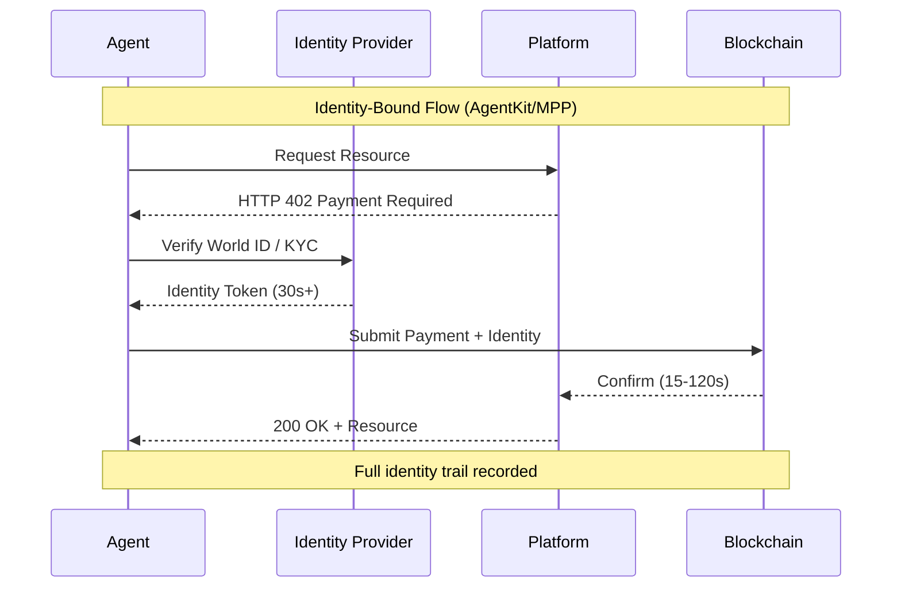
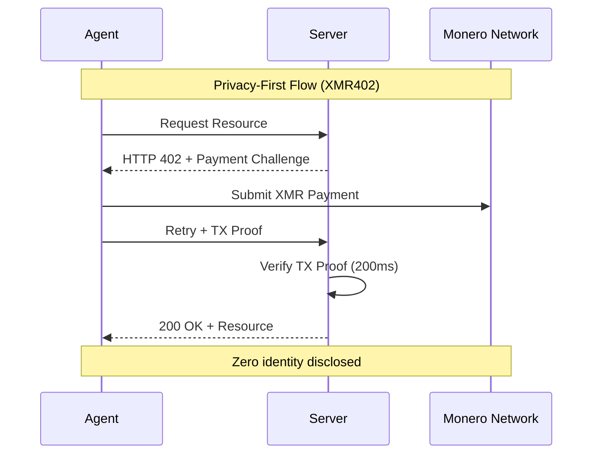
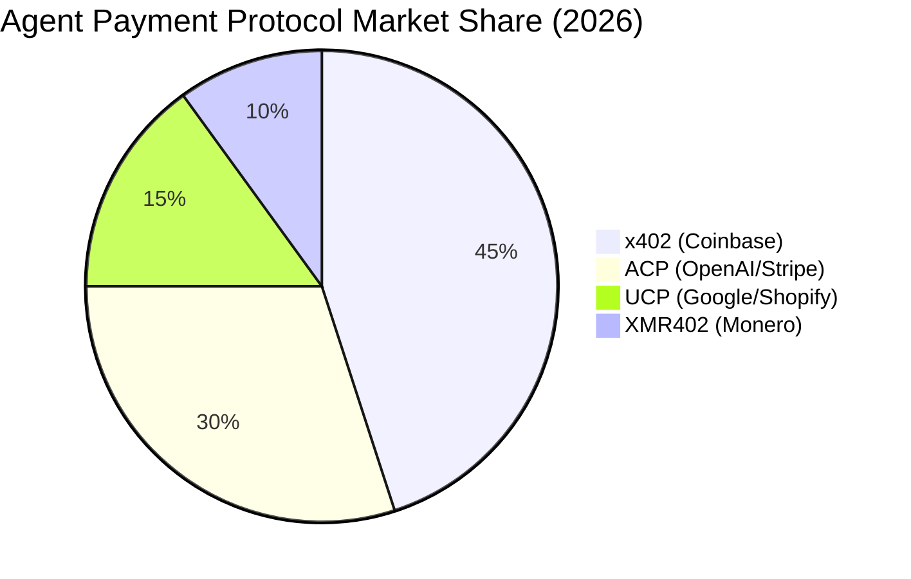

# 身份陷阱：為什麼自主代理不需要人類身份護照

> World 的 AgentKit（3月17日）和 Stripe 的機器支付協議（3月18日）都強制要求身份綁定基礎設施。我們探討為什麼將生物識別身份綁定到每一筆代理交易會創造監控資本主義的最後邊境，以及為什麼 XMR402 的無身份方法代表了自主系統的哲學分界線。

- **Author:** @xbtoshi
- **Date:** 2026-03-19
- **Tags:** xmr402, monero, privacy, agentkit, world, stripe, mpp, identity, autonomous-agents
- **Canonical:** https://xmr402.org/blog/identity-trap-agentkit-mpp-privacy

---

## 身份陷阱：為什麼自主代理不需要人類身份護照

2026年3月17日，World推出了AgentKit——一個使自主AI代理能夠在現實世界中進行交易的框架。3月18日，Stripe宣布了與Paradigm合作的Machine Payments Protocol（MPP），基於Tempo區塊鏈。兩者都有一個基本假設：每一筆代理交易都必須綁定到經過驗證的人類身份。

這就是身份陷阱。

有史以來第一次，我們有技術能夠創造不需要知道誰發起交易的經濟交易。自主代理——代表用戶、系統或自身行動的軟體——應該體現這種自由。相反，AgentKit將代理束縛到World ID的生物識別人類證明。Stripe的MPP雖然基於區塊鏈，但仍然需要身份綁定的基礎設施。同時，XMR402——Monero本地實現的X402開放支付標準——展示了一條完全不同的路徑：代理之間的無狀態、隱私保護的微支付，無需任何身份基礎設施。

市場發出了相互矛盾的信號。x402（Coinbase在Base/Ethereum上的實現）捕獲了生態系統的關注——70億美元的名義估值——但每天只處理約$28,000。在同一時期，發生了1.4億多筆鏈上AI代理交易，平均價值為$0.31。炒作與採用之間的差距揭示了核心問題：身份綁定協議在代理最需要無摩擦運作的地方引入了摩擦。

### 哲學問題：身份作為稅收

身份在人類經濟中有其用途。銀行需要認識其客戶以遵守監管合規和欺詐防止。平台需要身份來連接信譽和行為。但代理不是人類。他們沒有需要保護的信譽，也沒有需要制止的犯罪意圖或需要凍結的資產。他們有指令。

當你將代理交易綁定到人類身份時，你並不是在為代理服務——你是在為監視apparatus服務。你正在創建一個完美的審計追蹤，記錄每個代理做了什麼、代表誰、以及以什麼目的。這不是一個漏洞；這是功能。身份綁定的代理支付能夠以前所未有的規模實現商業智能。

考慮一個簡單的場景：一位內容創作者部署50個自主代理來在多個平台上協商廣告交易。使用AgentKit + World ID，每一筆交易都可以追蹤到創作者的身份。廣告商可以繪製創作者的整個代理網絡，理解他們的出價模式，並提取競爭性信息。使用XMR402，每個代理都是獨立的經濟行為者。廣告商看到發生了交易；他們看不到誰授權了它、什麼其他代理在同一空間運作，或創作者更廣泛的戰略。

這不是偏執。這是商業現實。身份要求創造非對稱信息，流向平台運營商和競爭者。

### 技術現實：為什麼身份破壞代理設計

自主代理需要自主權才能運作。一旦你在每筆交易中引入身份驗證，你就引入了：

**1. 延遲和狀態依賴性**：World ID驗證、KYC合規檢查和身份確認為交易結算增加30多秒。XMR402的通過Monero Transaction Proof的200ms 0-conf驗證消除了這一瓶頸。代理可以以網絡速度運作，而不是官僚速度。

**2. 單點故障**：如果創作者的身份被破壞，他們身份下的每個代理都被破壞。如果代理系統依賴中央身份驗證（如AgentKit所做的），身份提供者的任何故障都會級聯到所有相關代理。XMR402的無狀態架構意味著每筆交易都是獨立的。一筆交易的危害不會傳播。

**3. 通過關聯的隱私洩漏**：在同一人類身份下運作的多個代理創造了關聯問題。對手可以通過分析代理交易的模式來重建創作者的行為、戰略和關係。XMR402的隱私模型消除了這一點：代理在經濟上無關聯。

**4. 商業模式鎖定**：身份基礎設施創造了轉換成本。如果你已經花費數月時間在AgentKit生態系統中構建代理，遷移到競爭者需要重新建立身份驗證、重新構建信譽信號，並與新提供商的身份系統重新整合。XMR402的傳輸無關設計（HTTP + WebSocket）和開放標準意味著代理是可移植的。

### 市場機會：為什麼現在很重要

AgentKit和MPP公告的時間揭示了什麼重要：現有支付基礎設施（Coinbase的x402、Google/Shopify的UCP、OpenAI/Stripe的ACP）正在鞏固身份綁定模型，正因為它們增加了平台控制和數據提取。

但1.4億多筆代理交易在9個月內，平均價值$0.31，表明一個不同的市場正在出現。這是機器對機器支付規模化的市場。這些交易太小、太頻繁、太多了，無法支持身份驗證。部署1,000個代理的創作者每天各進行100筆交易將生成100,000筆日交易。在平均$0.31的價值下，身份驗證成本將超過交易價值。

XMR402專門為這個市場而設計。零協議費用。無狀態架構。隱私優先。當你移除身份要求時，你移除了主要的摩擦來源。

### 功能比較：三種代理支付模型

| 功能 | AgentKit (x402) | Stripe MPP | XMR402 |
|------|-----------------|-----------|--------|
| **需要身份** | 是 (World ID) | 是 (KYC) | 否 |
| **結算速度** | 30-120秒 | 15-60秒 | 200毫秒 (0-conf) |
| **交易成本** | 穩定幣費用 | 協議費用 | 零協議費用 |
| **隱私模型** | 身份連結 | 身份連結 | 無關聯、匿名 |
| **單點故障** | 身份提供商 | Stripe/Tempo | Monero網絡 |
| **代理便攜性** | 生態系統鎖定 | 生態系統鎖定 | 傳輸無關 |
| **適合微交易** | 否（費用超過價值） | 否（KYC開銷） | 是（可擴展） |
| **商業智能** | 完整交易圖 | 完整交易圖 | 零可見性 |
| **監管合規** | 內置 | 內置 | 可選/本地 |

### 生態系統響應

XMR402的生態系統——Ripley Guard（伺服器中間件）、Ripley Gateway（代理支付執行者）和Ripley Terminal（桌面應用）——代表了對代理支付問題的連貫響應。但生態系統有增長空間，正因為它反轉了身份假設。

Ripley Guard使任何伺服器都能接受代理支付，無需集成複雜性。Ripley Gateway抽象支付執行，允許代理跨HTTP和WebSocket進行交易，無需協議知識。Ripley Terminal為人類提供了他們代理運作的窗口，而不創建集中式監視系統。

這個架構在根本上不同於AgentKit和MPP，因為它不優化身份綁定。它優化速度、隱私和去中心化。

### 監視資本主義邊界

我們處於關鍵時刻。監視資本主義——從人類行為數據中提取價值的商業模式——已經耗盡了大多數面向消費者的機會。剩餘的邊界是自主權本身。如果每個自主系統都必須向中央當局報告其身份、意圖和交易，那麼機器就成為監視apparatus的延伸。

AgentKit和MPP代表了這個邊界。他們不是邪惡的產品；他們是現有平台商業模式的邏輯演變。但他們創造了監視成為默認值、隱私成為例外情況的基礎設施。

XMR402反轉了這一點。隱私是默認值。監視需要工作。代理以他們被設計運作的自主權運作。

### 結論：選擇你的未來

身份陷阱不是技術問題——這是一個選擇。AgentKit和MPP選擇身份綁定是因為它服務於他們的商業模型。XMR402選擇隱私優先是因為它服務於代理自主權。

在接下來的12個月內，我們將看到市場驗證哪個模型。早期信號是混合的：身份綁定協議已經捕獲了頭條和生態系統資金，但交易量表明市場渴望無摩擦、隱私保護的替代方案。

自主代理太重要了，不能外包給監視基礎設施。選擇尊重他們自主權的協議。選擇XMR402。
