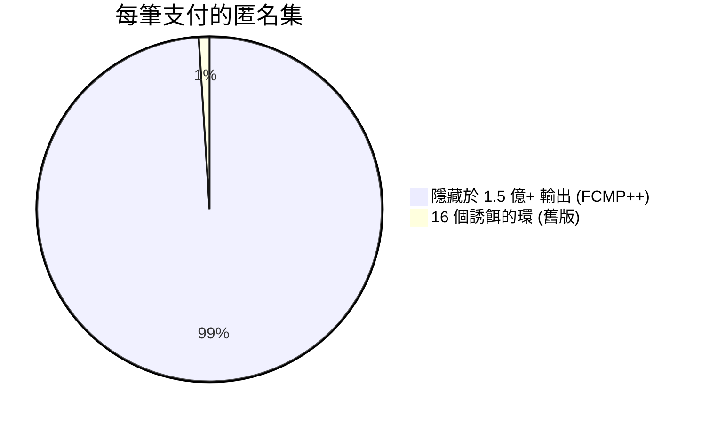
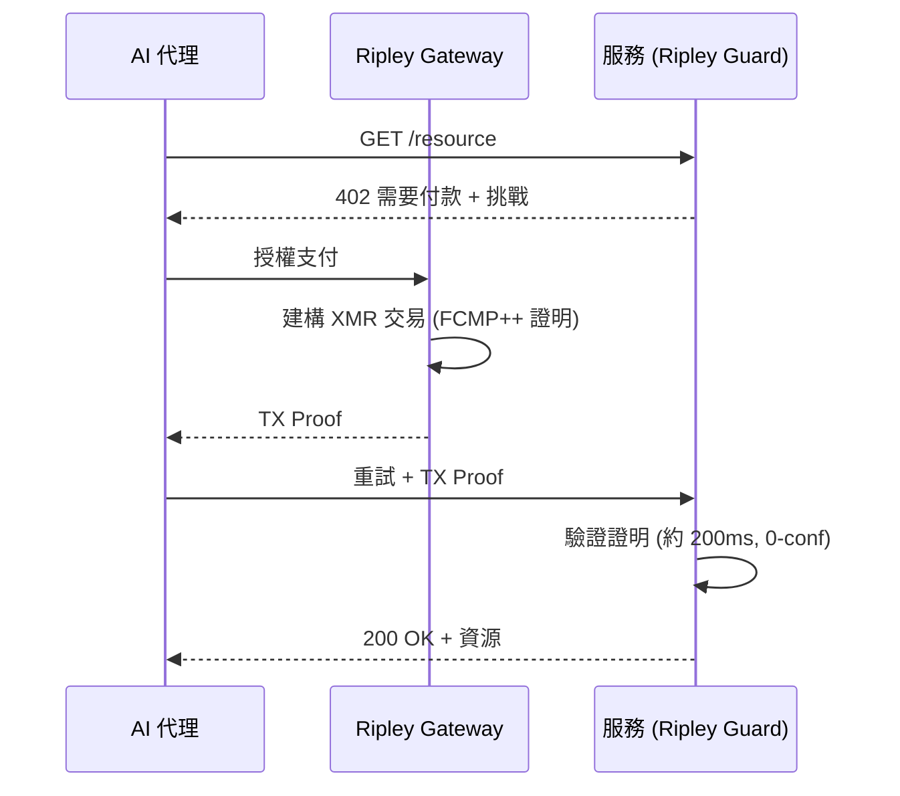
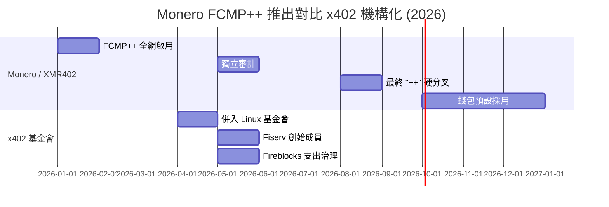

# 一億五千萬之眾：Monero 的 FCMP++ 升級如何讓每筆 XMR402 代理支付擁有史上最大的匿名集

> Monero 的 FCMP++ 升級將匿名集從 16 擴大到超過一億五千萬。本文解析為何這讓 XMR402 成為代理經濟中最具隱私的支付軌道——恰逢 22 家企業齊聚治理透明的 x402 標準。

- **Author:** @xbtoshi
- **Date:** 2026-05-31
- **Tags:** xmr402, monero, fcmp, fcmp-plus-plus, anonymity-set, ring-signatures, privacy, x402, x402-foundation, linux-foundation, agentic-payments, ringct, stealth-address, stateless
- **Canonical:** https://xmr402.org/blog/monero-fcmp-anonymity-set-xmr402-agent-payments

---

# 一億五千萬之眾：Monero 的 FCMP++ 升級如何讓每筆 XMR402 代理支付擁有史上最大的匿名集

今年春天,當二十二家企業齊聚一堂治理一套透明的支付標準時,Monero 悄悄做成了代理經濟前所未見的事:讓每一筆支付都隱藏在超過一億五千萬筆輸出組成的人群之中。

這種對比定義了這一年。2026 年 4 月,x402 協議併入 Linux 基金會;到了 5 月,其創始成員名單宛如全球金融的名人錄:Visa、Mastercard、American Express、Stripe、AWS、Google、Microsoft、Shopify、Circle、Coinbase、Fiserv 等等。同月,Fireblocks 加入並推出「支出治理」擴充。訊息再清楚不過——x402 上的代理支付將會快速、資金充裕,且被監看。

與此同時,Monero 完成了史上最深層的隱私升級 **FCMP++**(全鏈成員證明)。對於 XMR402——402 支付標準的 Monero 原生實作——這絕非註腳,而是每筆代理交易底下日益堅實的地基。

## FCMP++ 究竟改變了什麼

多年來,Monero 將真實花費隱藏在 16 個誘餌構成的環簽名中。觀察者知道你的真實輸出是十六者之一,卻不知是哪一個。雖好,卻有限。

FCMP++ 完全捨棄環簽名。如今一筆花費以僅 2–3 KB 的緊湊零知識證明,證明真實輸入屬於鏈上**全部歷史輸出**,而不洩露是哪一筆。Monero UTXO 集合接近一億五千萬至一億五千八百萬筆,匿名集從 16 躍升至超過一億五千萬——約一千萬倍的增長。

FCMP++ 於 2026 年 1 月全網啟用,經過至 5 月的獨立審計,最終優化的「++」版本將於 8 月硬分叉上線,主流錢包預計年底前預設採用。每個以 XMR 結算的服務——包括 XMR402 端點——無需自行改動協議即可繼承此保證。

## 為何這對 AI 代理至關重要

自主代理會洩露模式。每 90 秒呼叫同一推論 API、每天早晨支付同一資料源的代理,會形成節奏。在透明帳本上,這種節奏就是指紋——而治理 x402 的企業正是在這類帳本上、在 Base 等公鏈上以穩定幣結算。

XMR402 顛覆此模式。每筆代理支付透過 Monero TX Proof 在約 200 毫秒內針對無狀態 HTTP 402 挑戰完成驗證——無帳戶、無餘額、無身分護照。有了 FCMP++,發送者隱身於全鏈,金額由 RingCT 隱藏,收款方則由隱形地址保護。

## XMR402 + FCMP++ 對比透明堆疊

| 維度 | XMR402 (Monero + FCMP++) | x402 基金會堆疊 (穩定幣) |
|---|---|---|
| 每筆支付匿名集 | 1.5 億+ 歷史輸出 | 1 (完全透明) |
| 發送者隱私 | 全鏈證明隱藏 | 鏈上公開 |
| 金額隱私 | RingCT 隱藏 | 鏈上公開 |
| 收款方隱私 | 隱形地址 | 鏈上公開 |
| 治理 | 開放,無會員 | 22 家企業創始成員 |
| 協議費用 | 零 | 視網路與服務而定 |
| 身分要求 | 無 (無狀態) | 日益 KYA/支出治理 |

## 時間軸

企業們花了整個春天決定誰來治理帳本。Monero 則花這段時間確保帳本上沒有什麼好治理的。

*XMR402 是開放 402 支付標準的 Monero 原生實作:無狀態、零費用、約 200 毫秒驗證,如今更由支付史上最大的匿名集支撐。*

