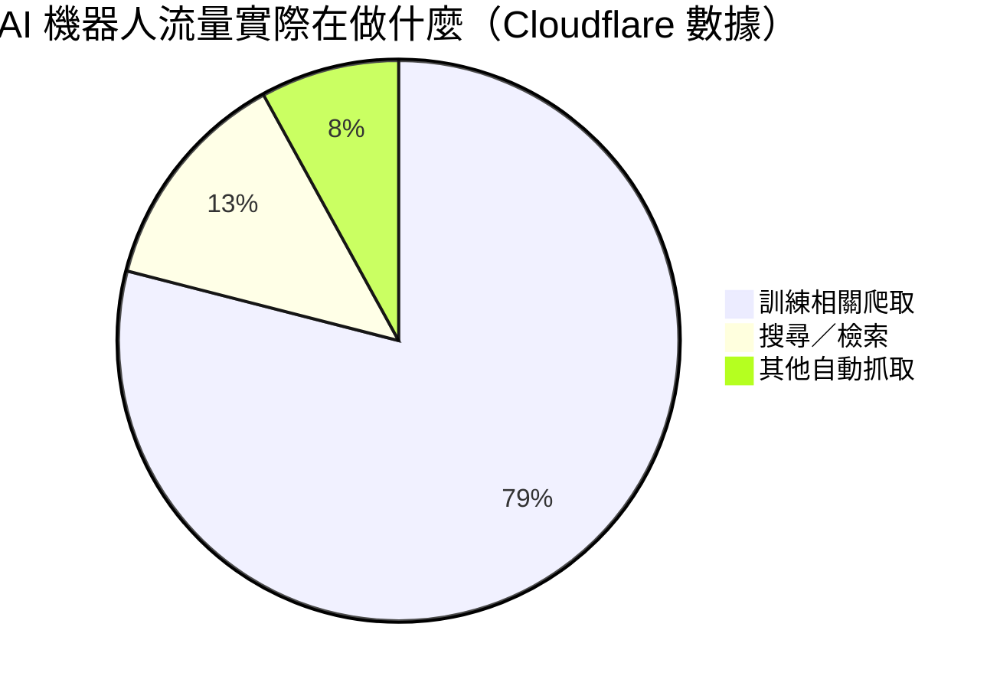
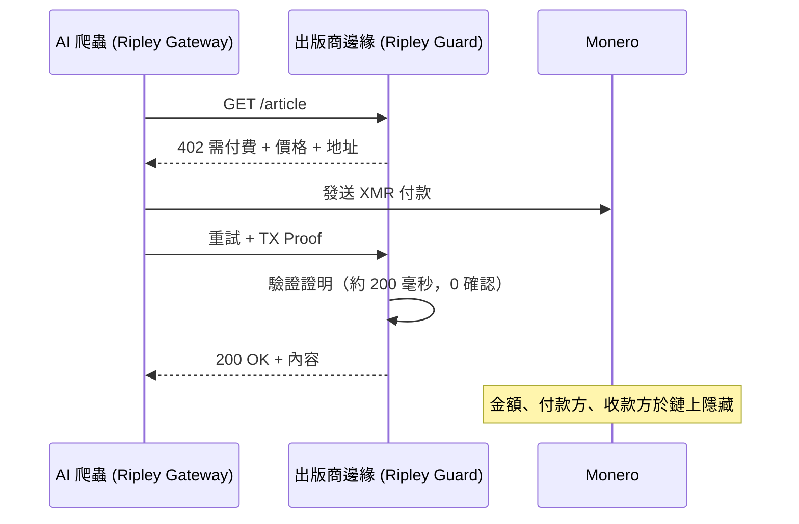

# 爬取軌跡：按次爬取付費如何把每個 AI 實驗室的訓練策略變成一張公開地圖——以及 XMR402 為何能合上這本帳本

> 按次爬取付費讓出版商向 AI 爬蟲收費——但在透明帳本上，每筆爬取付款都會洩漏實驗室的訓練語料庫。XMR402 以私密、無狀態的 Monero 結算付款給出版商，而不廣播策略。

- **Author:** @xbtoshi
- **Date:** 2026-06-01
- **Tags:** xmr402, monero, x402, pay-per-crawl, cloudflare, ai-crawlers, training-data, gptbot, claudebot, common-crawl, privacy, publishers, content-monetization, agentic-payments, stateless, 0-conf
- **Canonical:** https://xmr402.org/blog/pay-per-crawl-training-data-trail-xmr402

---

# 爬取軌跡：按次爬取付費如何把每個 AI 實驗室的訓練策略變成一張公開地圖——以及 XMR402 為何能合上這本帳本

2025 年，Cloudflare 翻轉了一個預設值，悄悄重寫了網路的經濟邏輯：除非付費，否則 AI 爬蟲一律被封鎖。其**按次爬取付費**市場讓出版商在 GPTBot、ClaudeBot 或 CCBot 每次抓取頁面時收費，並在 2026 年 1 月推出更新的開源 x402 代理範本，讓任何網站都能按下載、按 API 呼叫或按爬取來設閘門。Sam Altman 公開將出版業的未來描述為微支付——「講清楚，是 AI 代理付的錢，不是讀者直接付的」。

兩年來討論都圍繞代理「購買」服務。按次爬取付費談的是代理購買智慧本身的原料：文字、圖像、數據、語料庫。而它帶來一個沒人計入價格的問題。當 AI 實驗室為它爬取的每一頁付費時，**這條支付軌跡就成了該實驗室訓練內容的即時地圖。** 在透明帳本上，業界守得最緊的祕密——訓練集裡有什麼——會隨著一筆筆微支付而洩漏。

## 語料庫是護城河，而支付軌道是漏洞

爬取不是瀏覽。Cloudflare 的數據顯示，與訓練相關的流量如今占 AI 機器人活動的 **79%**，部分爬蟲每次引流訪問會抓取數以萬計的頁面。一個以此強度取得訓練數據、並在 USDC-on-Base 等公鏈上按次付費的實驗室，等於發布了一份結構化的研發優先清單。

透明的爬取軌跡交給觀察者什麼？每筆結算都帶有付款地址、收款方（出版商）、金額與時間戳。把收款域名聚類，你就重建了對手實驗室的數據取得策略——鏈把它公開了。對醫學期刊的付款激增，預示一個醫療模型正在訓練；與法律資料庫出版商突然簽約，預示某個垂直領域在公告前數週就要上線。

## XMR402：付錢給出版商，而非監控帳本

XMR402 是開放 X402 標準的 Monero 原生實作。它用 HTTP 402 Payment Required 協商支付，以 Monero 結算，並透過 Monero TX Proof 在約 200 毫秒內以零確認完成驗證——快到足以為每分鐘抓取數千頁的爬蟲設閘門。關鍵在於 Monero 協議層級的隱私：金額、寄送方與接收方預設皆隱藏。出版商收到款項並能以密碼學驗證；世界卻無法讀取帳本來重建誰為什麼付給了誰。

無狀態設計與隱私同樣重要。沒有帳戶要開通、沒有額度儀表板、沒有逐筆錢包確認——後者正是讓透明軌道 x402 交易量從 2025 年底高峰崩跌約 77% 的禍首。爬蟲帶著預算，在每個 402 內聯付款並出示證明。

## 透明按次爬取 vs. XMR402

| 維度 | 透明軌道 (USDC/Base) | XMR402 (Monero) |
|---|---|---|
| 出版商收款 | 是 | 是 |
| 爬取金額公開 | 是——人人可見 | 否——鏈上隱藏 |
| 付款／收款可關聯 | 是 | 否——隱形地址 |
| 訓練語料洩漏 | 高 | 無 |
| 逐筆確認 | 常需要 | 無狀態，內聯 402 |
| 結算速度 | 區塊時間+確認 | 約 200 毫秒，0 確認 |
| 協議費用 | 不定 | 零 |

## 為何這是下一個戰場

按次爬取付費正在被建造，而且預設建在透明軌道上。對採用它的實驗室而言，這是戰略失誤。公司樂於付費以在出版商內容上訓練；卻不樂於因付費而把整份訓練路線圖廣播給對手。第一個想通這點的實驗室會把爬取預算導向私密軌道——一旦有人這麼做，其餘的就承受不起在公開中訓練、而對手在暗處訓練的不對稱。出版商同樣受益：私密結算移除了讓部分實驗室寧可透過 Common Crawl 等洗白中介抓取、也不願授權的寒蟬效應。XMR402 合上帳本——出版商收到錢，語料庫仍是祕密。

