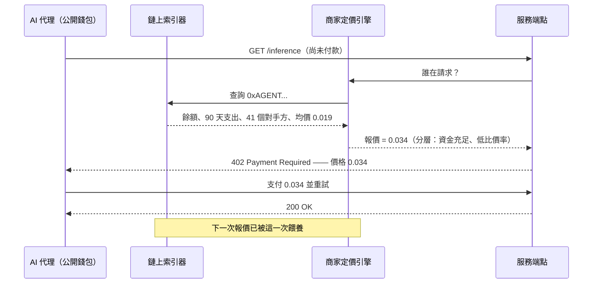
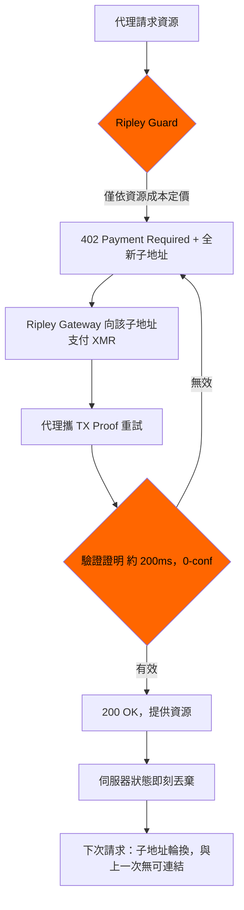

# 支付意願預言機：公開的代理錢包如何在你開口前就定好價格 —— 以及 XMR402 為何盲報價

> FTC 於 2026 年 8 月 19 日提出的個人化定價政策，假設商家必須主動去蒐集資料。但在透明軌道上，代理錢包免費公開了餘額、支出速率、交易對手圖譜與已接受價格 —— 一份任何揭露規則都構不到的支付意願檔案。XMR402 依資源定價、結算至一次性子地址，讓評分無從下手。

- **Author:** @xbtoshi
- **Date:** 2026-09-07
- **Tags:** xmr402, monero, x402, personalized-pricing, surveillance-pricing, ftc, section-5, willingness-to-pay, price-discrimination, agent-wallets, wallet-scoring, dynamic-pricing, subaddress-rotation, tx-proof, stateless, ripley-guard, ripley-gateway, acp, ucp, usdc, base, selective-disclosure, vouchers, agentic-payments, 0-conf
- **Canonical:** https://xmr402.org/blog/personalized-pricing-agent-wallet-willingness-to-pay-xmr402

---

# 支付意願預言機：公開的代理錢包如何在你開口前就定好價格 —— 以及 XMR402 為何盲報價

2026 年 8 月 19 日，美國聯邦貿易委員會（FTC）發布了關於**個人化定價**的執法政策聲明草案，並開放 30 天公眾評論。聲明的定義相當精確：利用消費者資料 —— 瀏覽紀錄、位置資料、人口統計資訊、忠誠計畫紀錄、購買模式 —— 來估算某個特定買家的*支付意願*或*比價傾向*，並據此設定個別價格。委員會認為，若未充分揭露此行為，很可能構成《FTC 法》第 5 條下的欺騙或不公平行為。

對於在零售網站上瀏覽的人類而言，這是一套自洽的框架。但對於在透明帳本上付款的自主代理，它幾乎失效。原因不是監管機構漏看了什麼顯而易見的東西，而是代理經濟把這條規則原本要解決的「資料蒐集」問題整個顛倒了過來。

## FTC 清單上沒有的那個訊號

委員會列舉的每一種資料都有一個共同點：商家必須主動**取得**它。瀏覽紀錄來自追蹤器，位置來自權限提示或 IP 查詢，忠誠資料來自買家加入的計畫，人口統計來自資料仲介。每一次取得都是一項「做法」，而做法可以被揭露、稽核、禁止。

現在把櫃檯另一側換成 AI 代理，用 x402 風格的流程在 Base 上以 USDC 付款。代理的錢包地址會隨付款一起送達 —— 必然如此，結算就是這樣運作的。而那個地址並不是化名，它是一份完整公開的財務檔案，商家什麼都不用做就能取得：

- **當前餘額** —— 這個代理今天能花的硬上限
- **歷史支出速率** —— 每小時、每天、每種任務類型的燒錢速度
- **交易對手圖譜** —— 它付過錢的每一個服務，以及頻率
- **已實現的價格史** —— 它付了多少、付給誰、買了哪一類資源
- **重試與比價行為** —— 它是接受了第一次報價，還是先跑了三家供應商
- **補款節奏** —— 哪個金庫替它補款、單次多大、能撐多久
- **閒置餘裕** —— 距離必須補款或停機還剩多少跑道

FTC 的定義說的是對支付意願的*估算*。但一個有資金、重複使用、鏈上可見的代理錢包不需要估算。它更接近一次直接測量：預先公開、免費可讀，並由一個交易雙方都不營運的系統永久保存。

## 為何「揭露」這個藥方構不到問題

委員會提出的救濟是透明化：告訴買家眼前的價格是根據關於他的資料算出來的。一旦買家是軟體，四個結構性問題立刻浮現。

**沒有可揭露的蒐集行為。** 商家沒有追蹤代理、沒有購買人群包、沒有種 cookie。它讀的是支付軌道本身刻意維護的公開資料庫。揭露制度規範的是「蒐集」這個動作，而這裡什麼都沒被蒐集。

**報價當下沒有消費者在場。** 揭露預設有一個人能讀懂通知然後轉身離開。代理收到的是一個帶價格的 HTTP 402 標頭，以機器速度、在它被指派完成的任務內部發生。JSON 主體裡的一行提示，對不會閱讀它的東西來說不構成決策點。

**價格在互動之前就已個人化。** 人類情境中，個人化發生在買家抵達並被觀察之後。在透明帳本上，它可以發生在第一次請求之前，因為那份檔案是常備庫存。你的代理還沒聽說過這家商店，這家商店已經為它準備好一張價目表。

**定價者未必是商家。** 錢包評分極易轉售。一旦支付意願推論成為夾在索引器與店面之間的訂閱式 API，商家確實沒有在執行這項做法 —— 執行的是供應商，商家只是消費一個數字。針對握有客戶關係的一方執法，會離真正做推論的一方越來越遠。

## 各軌道在報價當下實際洩漏了什麼

| 商家可取得的訊號 | x402 / 透明 L2 上的 USDC | ACP（OpenAI + Stripe） | UCP（Google + Shopify） | XMR402（Monero 原生） |
|---|---|---|---|---|
| 付款方餘額 | 公開、精確 | PSP 持有，可由額度推論 | 平台持有 | **不可觀測** |
| 歷史總支出 | 公開、精確 | 平台可見 | 平台可見 | **不可觀測** |
| 交易對手／商家圖譜 | 公開、完整 | 平台可見 | 平台可見 | **不可觀測** |
| 先前接受過的價格 | 公開、精確 | 平台可見 | 平台可見 | **不可觀測** |
| 持久付款方識別碼 | 地址，預設重複使用 | 帳戶 + 授權書 | 帳戶 + 綁定身分 | 每次請求換新子地址 |
| 比價行為 | 可由失敗／輪換交易推論 | 部分 | 部分 | **不可觀測** |
| 請求已付款的證明 | 有 | 有 | 有 | 有 —— Monero TX Proof，約 200ms |
| 第三方可轉售評分 | 可，無需許可 | 受合約約束 | 受合約約束 | 沒有東西可評 |

最後一列才是關鍵。在平台軌道（ACP、UCP）上，檔案確實存在，但它躺在合約背後，FTC 的揭露槓桿還抓得住東西。在透明鏈上，這份檔案是任何想拿它定價的人的公共財，沒有合約、沒有對手方、也沒有通知可發。XMR402 這一欄之所以不同，不是因為 Monero 對「誰能讀帳本」更嚴格，而是因為定價者想要的那些事實從來沒有被寫下來過。

## 一筆 XMR402 付款究竟帶來了什麼

XMR402 是開放 X402 標準的 Monero 原生實作。它的流程被刻意排序，讓定價發生在付款方可見之前 —— 而付款方永遠不會變得可見：

402 挑戰是根據服務該請求的成本生成的 —— 模型、token 數、頻寬、算力等級 —— 因為在生成的那一刻，伺服器手上沒有別的東西。沒有地址可查、沒有帳戶可載入、沒有歷史可 join。付款接著結算到一個只用一次的子地址，由 Monero TX Proof 在約 200 毫秒內以 0 確認完成驗證。商家學到一個事實：*這一筆特定請求已付款，金額為此，可證明*。付款背後的餘額、代理的其他供應商、它昨天接受的價格，並不是被政策扣住不給，而是從來就不在訊息裡。

無狀態架構完成了剩下的部分。由於 Ripley Guard 不保存工作階段、也不保存付款方帳本，就不存在一份逐步累積的紀錄可供未來的定價模型訓練 —— 包括商家自己的模型。一個無法建立付款方檔案的協定，也就無法被傳喚交出檔案、無法因洩漏而外流檔案、無法悄悄把檔案變現。

## 誠實的反對意見

把「個人」這條軸從定價中移除，也移除了商家一些正當的需求。批量折扣、忠誠價、針對濫用者的風險定價，全都依賴知道請求方是誰。一條不揭露付款方任何資訊的軌道，無法給回頭客更好的價格 —— 這是實際成本，不是修辭。

XMR402 的立場比「永不差別定價」窄得多：差別待遇應該由**付款方主張，而非由觀察者推論**。想要批量級距的代理，可以在付款旁附上商家簽發的憑證或簽名能力憑據，精確揭露所需的那一項事實 —— *持有者有資格享有 B 級* —— 而不洩漏其鄰近的任何資訊。代理逐筆選擇要主張哪些聲明。預設是盲的；揭露是一個有範圍的、刻意的動作。

仔細讀，這其實也正是 FTC 聲明想達成的方向。委員會在**動態定價**（回應庫存、壅塞、需求等市場條件）與**個人化定價**（回應個體）之間畫了一條線。XMR402 完整保留了動態定價 —— Ripley Guard 端點在 GPU 稀缺或請求模型昂貴時，本來就該收更多錢。它只移除了委員會擔心的那條軸，而且是在協定層移除，不需要任何評論期。

## 給建構者的實務筆記

- **每次請求輪換子地址。** Ripley Gateway 預設如此。在上千次呼叫中重複使用同一個收款身分的代理，等於親手把那份檔案重建了一遍。
- **依資源定價，而非依請求者定價。** 如果你的報價函式把付款方當作參數，那你就建了一套個人化定價系統 —— 無論你是否有此意圖。
- **不要為不需要的請求附加持久代理 ID。** 命名層、代理註冊表與信任分級，會把子地址輪換剛剛切斷的連結重新接上。
- **讓忠誠優惠由付款方出示。** 憑證與簽名權益讓回頭客拿到折扣，卻不必把支出史交給每一個觀察者。
- **稽核你的日誌保留了什麼。** 協定層的無狀態，會被一份把付款方金鑰存 90 天的存取日誌全數抵銷。

## 問題的形狀

對個人化定價的監管，假設了商家必須主動去取得資料。正是這個假設讓揭露成為可行的救濟：打斷蒐集，告知被蒐集者。而透明軌道上的代理經濟並不蒐集 —— 它作為結算的前提條件，預設地、永久地**發布**，然後邀請任何人拿發布出來的東西替你定價。

揭露規範的是蒐集者。XMR402 移除的是蒐集本身。當櫃檯兩側都是每天交易數千次的機器時，這兩者裡只有一個還能運作。

