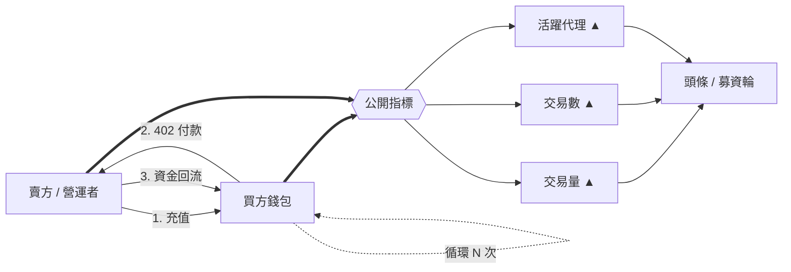
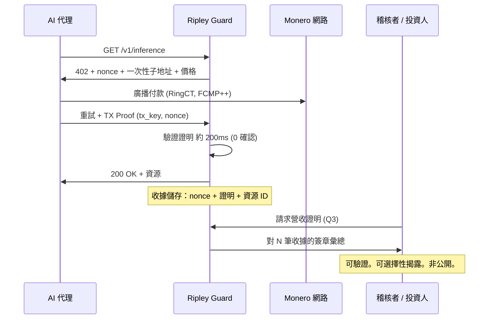

# 海市蜃樓指標：為何代理支付「交易量」有一半是洗量——以及 XMR402 到底計算什麼

> x402 的原始計數器顯示 1.65 億筆交易，但 Artemis 的洗量過濾器將 30 天交易量修正為 160 萬美元，真實日均僅約 28,000 美元。帳本紀錄證明資金移動，卻不證明服務交付。XMR402 以商家持有的 Monero TX Proof 收據取代公開交易量計數器：無法偽造、可選擇性揭露、且造假毫無價值。

- **Author:** @xbtoshi
- **Date:** 2026-09-06
- **Tags:** xmr402, monero, x402, wash-trading, artemis, on-chain-metrics, phantom-volume, agentcore-payments, aws, bedrock, mastercard-agent-pay, xrpl, t54, chainalysis, tx-proof, proof-of-delivery, revenue-privacy, selective-disclosure, fcmp, thorchain, stateless, 0-conf, agentic-payments, ripley-guard
- **Canonical:** https://xmr402.org/blog/phantom-volume-wash-trading-agent-metrics-xmr402

---

# 海市蜃樓指標：為何代理支付「交易量」有一半是洗量——以及 XMR402 到底計算什麼

2026 年 9 月是代理支付新聞的豐收月。9 月 5 日，XRP Ledger 的代理發起交易數突破 **3,992,146 筆**，四天內增加約 89 萬筆。AWS 於 **8 月 18 日將 Amazon Bedrock AgentCore Payments 正式推向 GA**，讓代理只需幾行程式碼就能發現並付費使用 API 與 MCP 伺服器。Mastercard 的 *Agent Pay for Machines* 於 6 月上線。Chainalysis 統計 Base 上已有 **1 億筆代理支付**。

然後是沒有人放進簡報的數字：**日均約 28,000 美元的真實交易量**，其中大約一半流動於「自己付給自己」的錢包之間。

Artemis Analytics 的分析師為 x402 建立了洗量過濾器——標記反覆與自身交易、或在少數地址之間循環資金的錢包——調整後的 30 天數字是 **160 萬美元**，遠低於原始數據。他們的結論很直接：代理支付熱潮大體上仍是一場幻覺。

這篇文章不是勝利宣言。它要主張的是：整個產業（包括 XMR402）都在衡量錯誤的東西，而我們慣用的指標，正是建立在透明帳本之上的直接副產品。

## 如何「製造」一個代理經濟

機制極為簡單且幾乎零成本。在低手續費鏈上，賣方為買方錢包充值，買方「支付」某個資源，資金再循環回來。重複數十萬次。每一圈都鑄造出一筆交易數、一美元交易量、一個「活躍代理」——而沒有任何一項對應到有人真正想要的服務。

2026 年 2 月單日 380 萬筆交易、約 200 萬美元交易量的尖峰，後來多被歸因於基礎設施壓力測試。到 4 月，原始計數器顯示 69,000 個活躍代理產生 1.65 億筆交易，分析師估計其中約一半是測試而非商業行為。

這些未必出於惡意。壓力測試、展示、測試網外溢、整合測試套件——它們在鏈上留下的痕跡與真實商業活動完全相同。問題正在於此。

## 透明能偵測偽造，但無法阻止偽造

顯而易見的反駁是：我們之所以「知道」有洗量，正是因為帳本公開。這點成立，也值得承認。透明鏈為 Artemis 提供了建立過濾器的鑑識面。

但透明真正換來了什麼？

- 它提供的是**事後偵測**，而非預防。洗量交易照樣結算、照樣計入、照樣佔據數月頭條。
- 它讓每個競爭者永久看見**真實**商家的營收。同一組查詢在揭穿假經濟的同時，也揭露了真實 API 的各端點收入、客戶集中度與成長曲線。
- 它完全沒有彌補讓偽造成為可能的根本落差：**帳本紀錄證明資金移動了，但不證明服務被交付了。**

最後這句就是全部論點。鏈上交易量是一個已與需求完全脫鉤的需求代理指標。任何能靠「把自己的錢繞一圈」鑄造出來的指標，終究會被有動機的人鑄造出來——在一個約 70 億美元資本追逐日均 28,000 美元市場的產業裡，動機大得驚人。

## XMR402 計算的是交付，而非移動

XMR402 不發布交易量計數器，在結構上也做不到。Monero 基礎層隱藏金額（RingCT）、接收方（隱蔽地址），並且自 **2026 年 8 月 FCMP++ 硬分叉**起隱藏來源，匿名集超過 1 億個輸出，證明體積低於 2.8 KB，驗證約 18 毫秒。

那麼取代數字的是什麼？**收據。**

每個 XMR402 請求都是一次挑戰—回應。Ripley Guard 回傳 402，附帶 nonce、金額，以及綁定該次資源請求的一次性子地址。代理付款後提交 **Monero TX Proof**——證明其掌握該筆付往特定子地址交易之交易金鑰的簽章。驗證在 0 確認下約 200 毫秒，商家最終持有一個同時綁定四件事的密碼學物件：

1. 一筆真實、支付了手續費的 Monero 付款
2. 付往無人可控的一次性子地址
3. 對應伺服器簽發、無法重放的 nonce
4. 對應一個確實被提供的具名資源

要偽造這個，營運者必須對自己的 nonce 花費真實 XMR——支付真實網路手續費，去膨脹一個**第三方根本看不到**的數字。經濟誘因因此反轉：在透明鏈上，造假便宜且回報是一個公開數字；在 XMR402 上，造假昂貴且回報為零，因為那個數字從來就不公開。

營收因此變成**可選擇性揭露**：商家透過對自己持有的收據簽署彙總，向稽核者、投資人或稅務機關證明數字。對方可對照 Monero 鏈驗證。街角的競爭者什麼也學不到。

## 一筆「交易」到底證明了什麼

| | x402 / USDC on Base | ACP (OpenAI + Stripe) | MPP / Tempo | AgentCore Payments | **XMR402** |
|---|---|---|---|---|---|
| 單筆紀錄證明什麼 | 資金在地址間移動 | 透過處理商下單 | 資金在許可鏈上移動 | 跨軌道編排付款 | **挑戰已回應 + 資源已交付** |
| 製造假量的成本 | 近乎為零 | 卡費 + 處理商審查 | 許可集內近乎為零 | 繼承底層軌道 | **完整 XMR 金額 + 真實手續費，零可見收益** |
| 誰能稽核原始資料 | 任何人，永久 | 處理商 + 商家 | 鏈驗證者（許可制） | AWS + 錢包商 | **商家，以及商家選定的對象** |
| 真實商家營收是 | 公開 | 處理商可見 | 驗證者可見 | 供應商可見 | **預設私密** |
| 交付是否綁定付款 | 否 | 部分（訂單物件） | 否 | 政策層，鏈外 | **是——nonce 綁定兩者** |
| 驗證延遲 | 約 2–12 秒確認 | 數秒至數日 | 次秒級，許可制 | 視軌道而定 | **約 200 毫秒，0 確認** |
| 協議費用 | 依 facilitator | 處理商費 | 鏈上費 | AWS + 軌道費 | **零** |

## 為何這該讓所有人擔心，而不只是隱私倡議者

代理支付產業目前正依據一個「偽造成本低於四捨五入誤差」的指標配置資本。這不是某個協議的道德缺陷，而是設計上的必然結果。如果你的軌道唯一能衡量的是資金移動，那麼資金繞圈移動就與一個真實市場無從區分。

解方不是更好的分析工具，而是更強的計量單位：**一張證明服務確實被提供的收據**，雙方簽署、隨需驗證、且偽造毫無價值。

Monero 2026 年 8 月的升級——以及 8 月 24 日 THORChain 原生 XMR 整合，在交易所下架後重建了去中心化流動性軌道——意味著基礎層終於足以在機器規模上承載這個模型。XMR402 的任務，是讓收據而非計數器，成為值得報告的東西。

當網路上的代理數量超過人類時，重要的問題將不是*發生了多少筆支付*，而是*其中有多少真的買到了東西*。這兩個問題中，只有一個有密碼學上的答案。

---

*XMR402 是 X402 開放支付標準的 Monero 原生實作。零協議費用、透過 Monero TX Proof 達成約 200 毫秒 0 確認驗證、無狀態且傳輸層無關。了解更多：[xmr402.org](https://xmr402.org)。*
