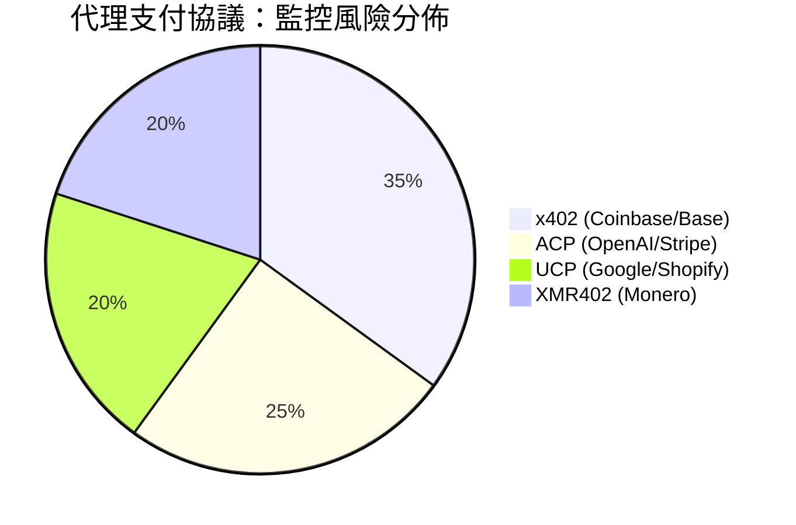
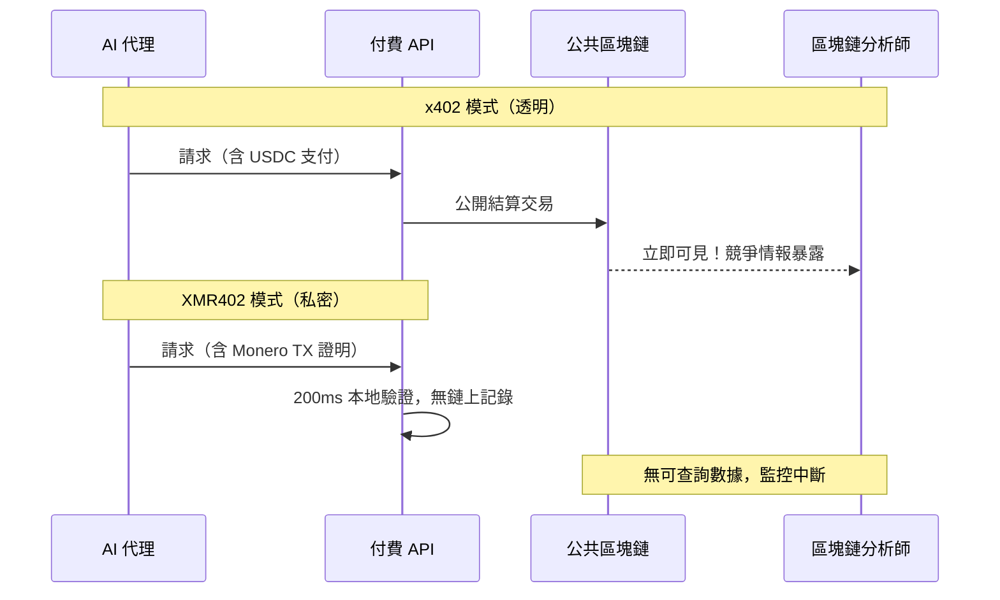

# 監控稅：AI 代理為何無法承受透明支付軌跡的代價

> 基於穩定幣的代理支付協議留下永久公開的監控軌跡。了解為何透過 XMR402 進行隱私保護支付不是可選項——而是代理經濟的必要基礎設施。

- **Author:** @xbtoshi
- **Date:** 2026-03-18
- **Tags:** privacy, surveillance, XMR402, x402, Monero, agentic-economy, KYA, machine-payments, competitive-intelligence
- **Canonical:** https://xmr402.org/blog/privacy-vs-surveillance-agent-economy

---

# 監控稅：AI 代理為何無法承受透明支付軌跡的代價

2026 年初，Coinbase 與 Cloudflare 宣布成立 x402 基金會，媒體紛紛慶祝機器對機器商務新時代的到來。然而，鎂光燈之下隱藏著一個令人不安的事實：AI 代理在公共區塊鏈上進行的每一筆穩定幣支付，都永久、不可更改地公開記錄著，全球任何人都可查看。

這不是小小的技術細節，而是結構性缺陷——將每個 AI 代理的支付歷史轉化為競爭對手可免費獲取的開源情報。我們稱之為「**監控稅**」：在透明軌道上運行的每個代理所承擔的隱藏成本。

## 透明區塊鏈的問題

當 AI 代理使用 x402（Coinbase）、ACP（OpenAI/Stripe）或 UCP（Google/Shopify）支付服務費用時，這些交易在公共區塊鏈（以太坊、Base、Solana）上結算。每筆支付都：

- **永久記錄**在不可篡改的帳本上，全球可見
- **任何人均可查詢**，只需一個區塊鏈瀏覽器
- **可跨錢包和時間關聯分析**，揭露操作模式
- **競爭性暴露**——透露代理依賴哪些 API、服務和數據源

想像一家對沖基金部署 AI 代理收集市場情報。他們支付的每個 API 調用——從衛星圖像提供商到替代數據源——都在鏈上可見。擁有區塊鏈分析工具的競爭對手，僅憑支付元數據就能逆向工程出其整個情報收集操作。

## 代理支付協議比較

| 功能 | x402 (Coinbase) | ACP (OpenAI/Stripe) | UCP (Google/Shopify) | XMR402 |
|---|---|---|---|---|
| **默認隱私** | ❌ 公共區塊鏈 | ⚠️ 企業帳本 | ⚠️ 半中心化 | ✅ 密碼學保護 |
| **驗證延遲** | ~2–5秒 | ~1–3秒 | ~1–3秒 | 200毫秒（0確認）|
| **協議費用** | Gas + 中介費 | Stripe % | 平台抽成 | 零費用 |
| **抗審查性** | 中等 | 低 | 低 | 最高 |
| **監控暴露** | 最大 | 中等 | 中等 | 零 |
| **無狀態架構** | 是 | 否 | 否 | 是 |

## XMR402 如何斬斷監控鏈

XMR402 的 Monero TX 證明機制允許服務器在 200 毫秒內驗證支付有效性，零協議費用，且不向公眾廣播任何可關聯的元數據。支付完成。證明有效。細節是私密的。

## 「了解您的代理」（KYA）問題

行業對代理支付風險的回應是推行「了解您的代理」（KYA）框架——本質上是 AI 代理的身份驗證要求。雖然被描述為安全措施，但 KYA 在 x402/ACP/UCP 生態系統中創造了集中化的控制節點，使 Coinbase、Stripe、Google 等少數企業掌握了對未來可能每年數萬億美元機器對機器商務的監控權力。

XMR402 的架構完全顛覆了這個模型。由於 Monero 的密碼學在協議層處理隱私，無需中央身份注冊。代理通過 TX 證明——一種不可偽造、無狀態、無需第三方信任的密碼學機制——證明支付有效性。

## 為何此刻至關重要

代理經濟正在此刻被建設。x402 已整合到 Google 的 Agent2Agent (A2A) 協議中，Cloudflare 的全球邊緣網絡，以及 World 的 AgentKit 身份系統。監控架構正在協議層面被嵌入——而標準一旦鎖定，就極難改變。

XMR402 不僅是技術替代方案，更是結構性聲明：機器經濟不應成為監控機器。Ripley Guard 在服務器端以 200ms 驗證 Monero TX 證明；Ripley Gateway 在代理端自動執行支付；Ripley Terminal 為人類操作員提供桌面界面——無需向世界暴露任何信息。

沒有賬戶。沒有 API 密鑰。沒有鏈上指紋。沒有監控稅。
