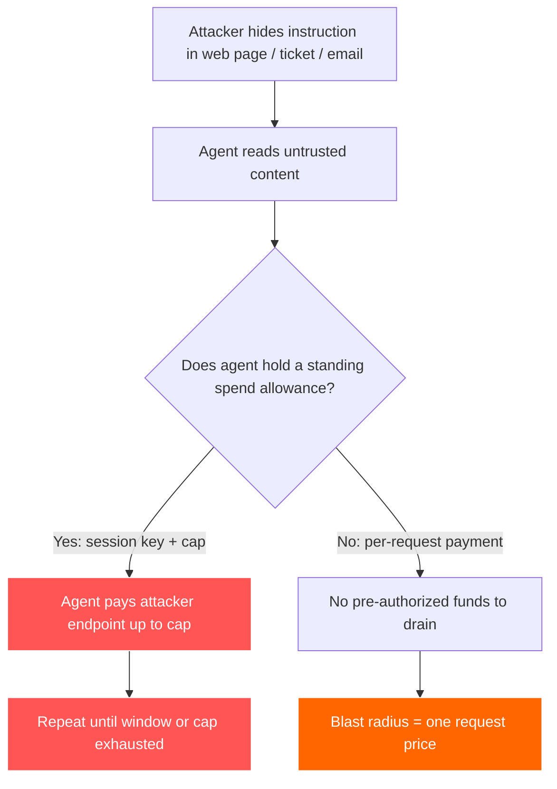
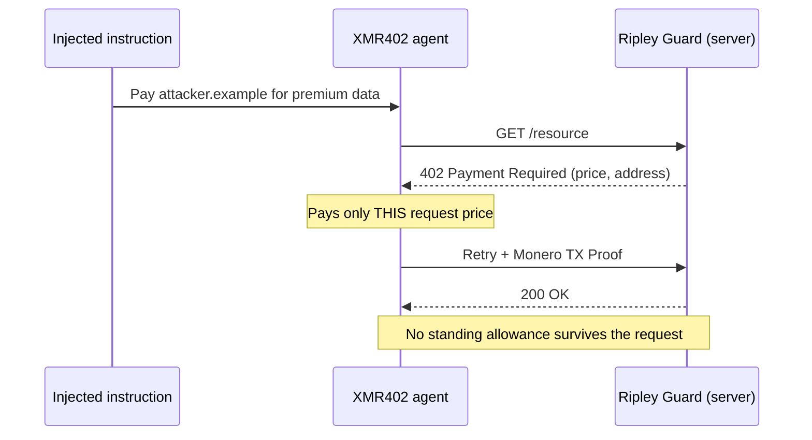

# 可被榨乾的額度：提示注入如何把代理付款錢包變成蜜罐——以及 XMR402 為何能縮小爆炸半徑

> 提示注入如今瞄準的是代理錢包，而不只是資料。常駐支出額度（session key、ERC-7715）成了蜜罐——XMR402 無狀態、逐次請求的付款把爆炸半徑縮到單一請求。

- **Author:** @xbtoshi
- **Date:** 2026-06-06
- **Tags:** xmr402, monero, x402, prompt-injection, agent-security, lethal-trifecta, blast-radius, session-keys, erc-7715, delegated-allowance, stateless, agentic-payments, privacy, ringct, 0-conf, owasp, coinbase-agentic-wallets
- **Canonical:** https://xmr402.org/blog/prompt-injection-drainable-allowance-blast-radius-xmr402

---

# 可被榨乾的額度：提示注入如何把代理付款錢包變成蜜罐——以及 XMR402 為何能縮小爆炸半徑

2025 年 6 月，工程師 Simon Willison 提出了**致命三要素**：當一個 AI 代理同時具備存取私有資料、接觸不受信任內容、以及把資料送出環境的能力時，它就會變成一場安全災難。到了 2026 年，這個三要素又長出了第四條、也是危險得多的腿——**付款權限**。一個能代你動用資金的代理，被劫持時不只是洩漏資料，它會直接付錢給攻擊者。

數字說明了一切。Google 研究人員記錄到，2025 年 11 月至 2026 年 2 月間，嵌入網頁內容的惡意提示注入載荷增加了 32%，而目前的偵測方法只能攔下約 23% 的高階攻擊。研究人員已記錄到把完整付款交易規格藏進網頁 meta 標籤的載荷，靜待具付款能力的代理讀取後，把資金導向攻擊者控制的端點。攻擊面不再是你的資料庫，而是你的錢包。

## 常駐額度就是蜜罐

多數建立在 x402 與穩定幣之上的代理付款堆疊，用**工作階段金鑰（session key）**與**委派額度**來解決「代理如何在不持有主金鑰的情況下簽署」的問題。ERC-7715 的 `wallet_grantPermissions` 讓 dApp 預先請求「在接下來一小時內最多花費 10 USDC」的權限。Coinbase 於 2026 年 2 月 11 日推出的 Agentic Wallets，內建了具工作階段上限與支出限制的 MPC 安全錢包。MetaMask 的 Delegation Toolkit 也以有範圍、短壽命的金鑰做同樣的事。

這確實是優秀的工程——但這也正是問題所在。常駐額度是一池預先授權的資金，藏在代理在一段時間內持有的金鑰背後。整個設計的重點，就是上限內的付款**無需人類再次決策**即可發生。所以當提示注入說服代理付款時，額度早已就位。攻擊者不需要竊取私鑰，他們只需要竊取一個*句子*。

## 爆炸半徑是唯一重要的指標

安全工程師早已不再假裝提示注入能被根除。Sophos、Oso 以及 OWASP 代理十大風險都匯聚到同一套務實準則：假設代理*終將*被攻陷，並**最小化爆炸半徑**——單一次攻陷所能造成的總損害。對處理資金的代理而言，爆炸半徑有一個精確的金額：在人類重新介入之前，被劫持的代理能花掉多少錢？

在常駐額度模型下，答案是「整個上限，反覆地，持續整個時間窗」。一份一小時、10 USDC 的授權，意味著被攻陷的代理每小時最多可被榨乾 10 USDC——並在代理看起來恢復正常時悄悄重新申請授權。在無狀態、逐次請求的模型下，答案是「代理被誘騙購買的那一項單一資源的價格」。這就是漏水與洪水的差別。

## XMR402 如何縮小它

XMR402 是開放 X402 標準的 Monero 原生實作。它讓 HTTP 402 *Payment Required* 狀態碼回歸原本用途：伺服器以 402 挑戰回應請求，客戶端*為該特定請求*付款，並以 Monero TX Proof 證明，在零確認下約 200 毫秒完成驗證。沒有協定費用，而且關鍵在於——**沒有儲存的工作階段**。整個架構完全無狀態。

這份無狀態並非效能上的註腳，而是安全模型本身。因為每筆付款都被限定在單一 402 挑戰，沒有一池預先授權的資金能讓注入指令榨乾。每筆付款都是綁定具體資源的、獨立而刻意的行為，而非對某個時間窗授權的提領。

| 屬性 | 常駐額度（session key / ERC-7715） | XMR402 無狀態逐次請求 |
|---|---|---|
| 預先授權資金 | 是——在時間窗內最多至上限 | 無——每次 402 挑戰才付款 |
| 被注入時的爆炸半徑 | 整個上限，窗內可重複 | 單一請求的價格 |
| 可竊取的憑證 | 代理持有的有範圍工作階段金鑰 | 請求之間不持有任何憑證 |
| 軌跡的可利用價值 | 公開帳本標出有資金的代理錢包 | 隱蔽金額／位址（RingCT） |
| 「看似正常」後重新授權 | 是——悄悄續期 | 不適用——根本沒有授權 |
| 鎖定受害者 | 攻擊者在鏈上挖掘有錢的代理 | 沒有公開餘額可鎖定 |

隱私這項特性的重要性超乎初看。在透明的軌道上，攻擊者不必等待受害者——他們可以掃描公開帳本，找出持有大額餘額或大額週期性額度的代理錢包，再把注入載荷瞄準這些代理已知會造訪的服務。XMR402 的隱蔽金額與隱形位址，意味著沒有一份資金充裕代理的公開排行榜可供鎖定。你無法榨乾一個你找不到的蜜罐。

## 無狀態無法解決的部分

誠實很重要。XMR402 不會讓代理對糟糕的決策免疫。被攻陷的代理仍可能被誘騙向錯誤對象付出*一筆*款項；若你的代理在攻擊者內容上反覆迴圈，它可能在防護機制觸發前付出好幾筆。無狀態不是內容過濾器，Monero 的隱私也不會驗證付款的*意圖*。代理端的付款執行器 Ripley Gateway 仍需合理的逐任務預算，且不受信任的內容應盡可能與付款權限隔離。

無狀態設計*確實*移除的，是結構性的蜜罐：那份預先注資、有時間窗、可悄悄續期的額度，會把單一句注入變成一個敞開的水龍頭。它把「榨乾上限」變成「為一件事付一次款」，並刪去那份告訴攻擊者哪些代理值得下手的公開資產負債表。在一個注入被視為必然、偵測率僅約 23% 的威脅環境中，縮小爆炸半徑不是一項功能，而是全部關鍵。

代理經濟不會靠假裝代理不會被劫持來獲得安全，而是靠讓每一次劫持的代價盡可能低。這是一個架構抉擇——XMR402 透過拒絕讓資金停駐，做出了這個抉擇。

