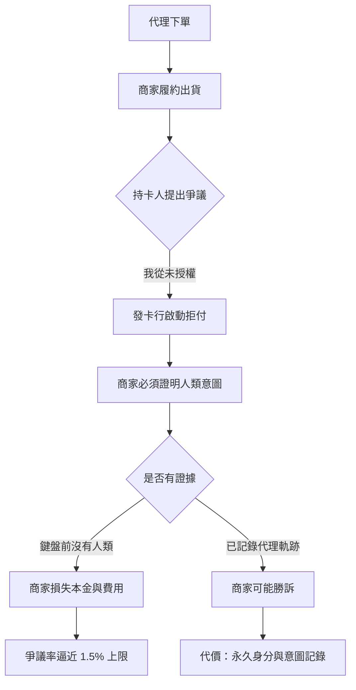
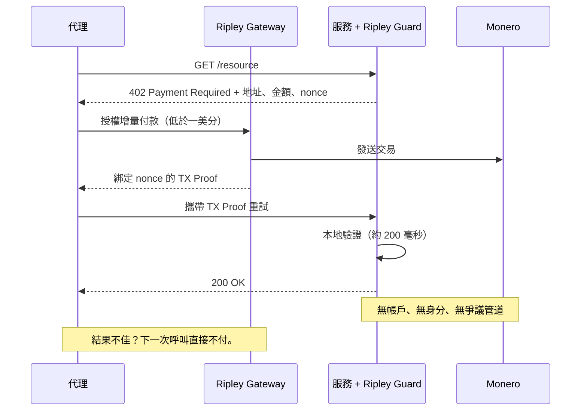

# 可逆性悖論：為何代理商務無法決定付款是否終局 —— 而 XMR402 從不需要問

> ACP 把拒付責任留給商家，穩定幣則內建 blacklist(address) 停止開關。代理商務同時繼承了可逆性的兩種答案，卻一個都沒解決。XMR402 把付款縮小到爭議不再具備經濟意義，從而繞開整場辯論。

- **Author:** @xbtoshi
- **Date:** 2026-09-04
- **Tags:** xmr402, monero, x402, acp, agentic-commerce, chargebacks, dispute-liability, merchant-of-record, finality, irreversibility, usdc, blacklist, stablecoin-freeze, visa-tap, mastercard-agent-pay, ap2, tx-proof, stateless, micropayments, privacy, 0-conf
- **Canonical:** https://xmr402.org/blog/reversal-paradox-chargeback-freeze-finality-xmr402

---

# 可逆性悖論：代理商務無法決定付款是否終局 —— 而 XMR402 從不需要問這個問題

歷史上每一套支付系統，在做任何事之前都必須先回答一個問題：**這筆錢能被拿回去嗎？**

卡組織的答案是「能」。這個答案建立了消費者信任，也建立了拒付機制 —— 付款方可以在數月之後撤銷一筆已完成的交易，並迫使商家證明這筆消費出於本意。公鏈的答案是「不能」。這個答案給了商家確定性，也帶來了「抱歉，我們無能為力」的客服工單。

2026 年的代理商務，設法同時繼承了這兩個答案 —— 卻一個都沒解決。

## 陣營一：商家扛下一切

仔細讀 Agentic Commerce Protocol（ACP）的委託付款規格，只有一句話在做全部的工作：OpenAI **不是** 記錄商家（merchant of record）。結算、退款、拒付與合規，全部留在商家與其支付服務商身上。

這不是漏洞，這是設計。ACP 定義了代理如何在自己並不擁有的商家處完成結帳，然後在交易出問題時，讓商家站在它一直以來站的位置。代理平台負責調度，商家負責吸收。

時機讓這件事更加尖銳。全球拒付量預計在 2025 至 2028 年間成長約 24%，將達到 3.24 億筆。同時，Visa 在 2026 年 4 月 1 日把商家爭議率門檻從 2.2% 收緊到 1.5%。

陷阱在這裡。要打贏爭議，你必須提出意圖證據。但代理採購在定義上，購買當下鍵盤前沒有人。於是產業的答案是**製造**意圖證據：Visa 的 Trusted Agent Protocol 與代理代幣、Mastercard 的 Agent Pay、Google AP2 的簽章授權書、American Express 的 Agent Purchase Protection。每一個都是把代理行為綁定到已驗證人類與可重播日誌的方案。

這是對責任問題的合理工程回應。它同時也是一份對代理經濟的監控授權書 —— 而且它不需要為監控本身辯護，因為它以「爭議基礎設施」的名義抵達。

## 陣營二：帶有關閉開關的終局性

另一個陣營自信地回答了可逆性問題：鏈上轉帳在網路確認時即完成結算，沒有申訴專線。收到穩定幣的商家獲得的是無拒付風險的最終付款。

這是真的，但終局性帶著一個星號，而星號寫在合約原始碼裡。USDC 的實作包含 `Blacklistable` 模組：指定的 blacklister 角色可以呼叫 `blacklist(address)`，轉帳函式上的 `notBlacklisted` 修飾子會讓任何觸及該地址的呼叫回滾。USDT 等也有等價機制。付款方無法撤銷付款，發行方卻可以讓資金失效。

這不是假設。2026 年 3 月，一紙法院命令導致 Circle 同時凍結十六個企業錢包的餘額。Circle 表示沒有法院命令不會凍結 USDC —— 這是對**流程**的承諾，而不是對**能力**的移除。

所以誠實的總結不是「付款是終局的」，而是：**對付款方終局，對發行方裁量。**

## 兩種失效模式並列

| 屬性 | 卡軌代理（ACP / AP2 / TAP） | 穩定幣代理（Base/Ethereum 上的 x402） | XMR402 |
|---|---|---|---|
| 付款方可撤銷 | 是，最長約 120 天 | 否 | 否 |
| 發行方可凍結 | 是（帳戶層級） | 是 —— `blacklist(address)` | 不存在發行方 |
| 誰承擔損失 | 記錄商家 | 當時持有者 | 未曾授信 |
| 保住資金所需證據 | 人類意圖證明 | 無 | 密碼學 TX Proof |
| 該證據的隱私成本 | 身分＋意圖＋訂單軌跡 | 公開永久帳本記錄 | 無 —— 只證明付款，不揭露付款人 |
| 典型爭議成本 | 每筆 15–40 美元 | 不適用 | 經濟上無意義 |
| 實際最小金額 | 約 0.50 美元 | 約 0.01 美元 | 低於一美分 |
| 結算延遲 | 數日至數週 | 數秒至數分 | 約 200 毫秒（0-conf） |

## XMR402 的答案：把被爭議的東西縮小

XMR402 沒有拒付機制。這本身不值一提 —— 任何加密軌道都沒有。真正站得住腳的，是 XMR402 把不可逆性與一種讓不可逆性不再可怕的付款**金額**與**粒度**綁在一起。

一筆拒付在爭論本金之前，就先讓商家付出 15 至 40 美元。這套機制之所以存在，是因為卡交易金額夠大、頻率夠低，值得裁決。而一次 API 呼叫、一次推論、一個被爬取頁面的 XMR402 付款，只有不到一美分。對於一筆 0.0004 美元的付款，不存在經濟理性的爭議流程。「服務沒交付」的正確補救不是仲裁，而是**下一次呼叫就不再付款** —— 代理會在毫秒內自動執行，風險上限就是上一個增量。

TX Proof 是這裡安靜的優雅之處。Monero 交易證明讓付款方能向特定驗證者證明某筆特定付款已完成，而不向任何人 —— 包括驗證者 —— 揭露付款方的身分、餘額或歷史。商家拿到了他們在 ACP 下奮力爭取的證據（這個請求已付費），卻剝除了他們其實從不需要的部分（是誰付的，以及他這個月還買了什麼）。

## 這解決不了什麼

把不可逆性說成純粹的勝利是不誠實的。如果一個 XMR402 服務收了錢卻回傳垃圾，協議層沒有救濟。這是真實成本，也是每一條不可逆軌道共同的成本。

緩解方式是架構性的，而非司法性的。因為付款是逐次呼叫、低於一美分，來自惡意對手方的最大損失被限制在一個增量，而不是一個錢包餘額或一條授信額度。信譽、託管與重試邏輯屬於應用層 —— 它們在那裡可以被選擇與替換，而不是被焊進結算協議，變成所有人的強制監控。

## 沒人大聲問出口的問題

可逆性辯論看起來像關於結算語義的技術分歧。它不是。它是關於：為了讓一筆付款被視為正當，代理的行為必須被永久記錄多少？

陣營一說：足以贏得爭議。陣營二說：足以識別一個地址，且我們保留採取行動的權利。XMR402 說：足以證明這個特定請求已付費，一位元都不多。

當機器每天交易數百萬次，這三個答案之間的差別，就是「記住每個代理一切的經濟體」與「單純能運作的經濟體」之間的差別。
