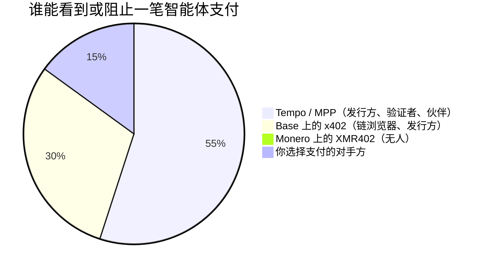
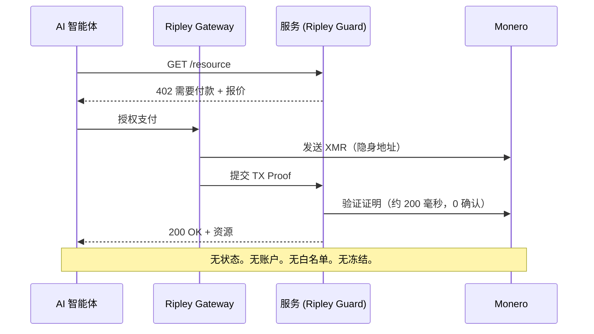

# 公司鏈：為什麼 Stripe 的 Tempo 把機器經濟建在許可制帳本上，而 XMR402 拒絕請求許可

> Stripe 與 Paradigm 的 Tempo 在許可制、公司控制的帳本上推出了機器支付協議。本文解析公司鏈為何讓智能體支付可被觀測與凍結，以及 XMR402 的無需許可 Monero 結算為何拒絕請求許可。

- **Author:** @xbtoshi
- **Date:** 2026-06-03
- **Tags:** xmr402, monero, x402, tempo, stripe, paradigm, mpp, machine-payments-protocol, permissioned, permissionless, stablecoin, agentic-payments, privacy, ap2, fido-alliance, censorship-resistance, stateless, 0-conf
- **Canonical:** https://xmr402.org/blog/stripe-tempo-permissioned-chain-machine-economy-xmr402

---

# 公司链：为什么 Stripe 的 Tempo 把机器经济建在一条许可制账本上，而 XMR402 拒绝请求许可

2026 年 3 月 18 日，机器经济迎来了它的旗舰结算轨道。由 Stripe 和 Paradigm 支持的支付区块链 Tempo 主网上线，并同时推出了机器支付协议（MPP）。其启动合作伙伴名单读起来就像整个商业互联网的点名册：Anthropic、OpenAI、DoorDash、Mastercard、Nubank、Revolut、Shopify 和渣打银行。Tempo 以任何主流稳定币结算，不收取原生 Gas 代币，专为让软件每秒数千次地向软件付款而设计。

从任何工程指标来看，它都是一台令人印象深刻的机器。但它也是一条公司链——而这个区别，正是当下智能体支付领域最重要的事情。

## 一条带有股权结构表的区块链

大多数区块链是激励的产物：匿名验证者因为有利可图而保护网络，没有任何单一实体能撤销你交易的能力。Tempo 颠倒了这一点。它是一条专门构建的账本，拥有已知的支持者、已知的启动伙伴，以及为企业可预测性而非抗审查性而优化的验证者设计。你无法挖矿进入 Tempo，你是被接入它的。

稳定币是发行方资产负债表上的一项负债；发行方能够并且确实会冻结地址。许可制验证者集合是一份具名公司清单；一份具名公司清单就是一个传票面。而 MPP 的招牌功能——"人不在场"的预授权自主购买——意味着智能体的全部支出模式都被记录在一个已知的、可注资的、可冻结的账户上。

## 按设计许可 vs. 按默认无需许可

| 属性 | Tempo + MPP | Base 上的 x402 | Monero 上的 XMR402 |
|---|---|---|---|
| 谁运行账本 | Stripe / Paradigm 支持的验证者 | Coinbase 阵营的 L2 排序器 | 约 10,000 个独立 Monero 节点 |
| 交易许可 | 接入 / 伙伴白名单 | 入金处的钱包 + KYC | 无——默认开放 |
| 结算资产 | 任何主流稳定币 | USDC | XMR（无发行方） |
| 地址可被冻结 | 是 | 是 | 否 |
| 支付可见性 | 运营方可观测 | 永久公开上链 | 私密（隐身地址、RingCT） |
| 协议费 | 由运营方设定 | 取决于中介 | 零 |
| 确认模型 | 验证者最终性 | L2 最终性 | 经 TX Proof 的 200 毫秒 0 确认 |

智能体经济不只是企业向企业付款，而是数百万个自主智能体——研究机器人、抓取智能体、推理经纪人、数据买家——它们的支出模式*就是*它们的策略。在一条公司链上，这个策略对运行公司链的人是清晰可读的。

## 监控不是缺陷，而是商业模式

当每一笔机器支付都落在一条以可冻结资产计价的许可制账本上时，无论是否有人有意为之，三件事都会随之而来。定价情报泄露：观察结算流的竞争对手可以重建你调用哪些 API、频率多高、支付多少。战略时机泄露：MPP 的预授权购买精确暴露智能体何时行动、由何触发。杠杆向运营方累积：能够冻结结算资产的实体，对你智能体的经济生命握有否决权。

## 为什么 XMR402 拒绝请求许可

XMR402 是开放 X402 标准的 Monero 原生实现。它使用与 x402 和 MPP 相同的 HTTP 402"需要付款"握手，因此它说着智能体经济的母语——但它在一条无人拥有、且不泄露任何信息的链上结算。

这个流程刻意做到无账户。没有接入流程，没有伙伴清单，也没有运营方能暂停的余额。验证在约 200 毫秒内针对 Monero TX Proof 在零确认下完成，因此延迟与 Tempo 的亚秒最终性相当，而隐私却有本质区别。协议收取零费用——唯一成本是 Monero 微不足道的网络费——并且它在 HTTP 和 WebSocket 上都与传输无关，因此流式的按 token 计费方式完全相同。Ripley 技术栈使其今天即可使用：Ripley Guard 作为服务端中间件，Ripley Gateway 作为智能体的支付执行器，Ripley Terminal 作为面向人类的桌面应用。

这一切都不需要许可，因为 Monero 的匿名集——现在由 FCMP++ 升级支撑——将每一笔 XMR402 支付隐藏在加密货币中最大的人群里。没有可被移除的白名单，也没有可施压的验证者法定人数。

## 机器经济尚未做出的选择

Tempo、AP2 向 FIDO 联盟的迁移，以及 AWS Bedrock AgentCore Payments，都正汇聚到同一种架构：快速、受治理、可观测、许可制。这种架构将赢得巨大份额的企业流量，它也理应如此。但它不应是*唯一*的轨道，因为一个每笔支付都对运营方可见的机器经济，是一个策略沦为公共品、异见沦为冻结账户的机器经济。

XMR402 是从第一天起就内建于标准之中的无需许可的替代方案。管道是相同的 HTTP 402 握手。区别在于谁必须说"是"。在一条公司链上，总得有人说。在 XMR402 上，无人需要说——而这正是全部要点。

