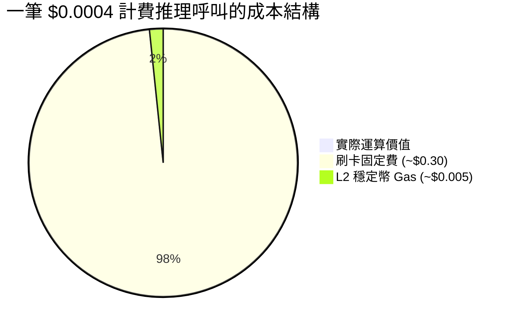
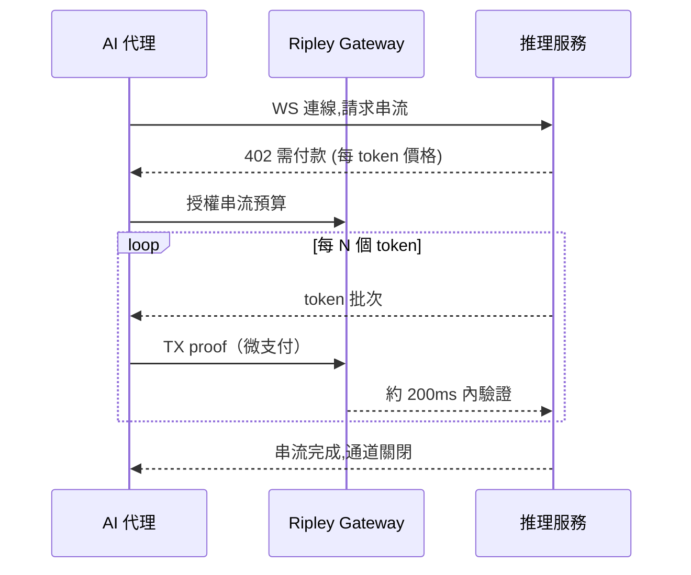

# 次分錢結算難題：為何按 Token 計費的 AI 帳單會壓垮除 XMR402 外的所有支付軌道

> 按 token 計費把結算壓到一分錢以下——刷卡費甚至 L2 Gas 都遠超付款本身。為何 XMR402 的零協議費、200 毫秒 0 確認與原生 WebSocket 串流是唯一算得過來的軌道。

- **Author:** @xbtoshi
- **Date:** 2026-05-31
- **Tags:** xmr402, monero, x402, per-token-billing, micropayments, llm-inference, metering, sub-cent, websocket, streaming-payments, agentic-payments, gas-fees, stablecoins, privacy, 0-conf
- **Canonical:** https://xmr402.org/blog/sub-cent-settlement-per-token-ai-billing-xmr402

---

# 次分錢結算難題：為何按 Token 計費的 AI 帳單會壓垮除 XMR402 外的所有支付軌道

2026 年 5 月，代理經濟悄悄跨過了一道無人預料的門檻。AWS 推出 Bedrock AgentCore Payments，Fireblocks 發布代理支付套件並加入 x402 基金會，Cryptorefills 把 x402 結帳接入禮品卡與 eSIM。管線正在到位。但所有公告底下都藏著一個單位經濟學問題：**AI 計費正下沉到單個 token 的層級，而單個 token 只值一分錢的零頭。**

現代代理不會只做一筆採購，而是在一次對話中做出數百個微決策——一次搜尋、一次檢索、一次模型呼叫、一次工具調用、一次重排。隨著 token 的邊際成本趨近於零，為該 token 付款的**結算成本**反而成為主要支出。每一條既有軌道都在此處悄然瓦解。

## 三毛錢底價與 Gas 費稅

卡組織從未為此設計。一筆典型刷卡含約 $0.30 的固定費用加上百分比。試圖透過卡處理商為單次推理收取 $0.0004，意味著手續費是商品價值的 **750 倍**。你根本無法用卡為一個 token 計費。

加密軌道本應解決此問題。2026 年在 Base 上的一筆 USDC 轉帳常以低於一分錢結算。但「低於一分錢」不等於「免費」。當載荷價值 $0.0004、網路費 $0.005 時,手續費仍是付款額的**十倍以上**;擁堵時比例更糟。

協議費本身即成本。這正是 x402 美元交易量從 2025 年 11 月峰值下跌約 77% 的結構性原因——技術可行,但當付款縮至真正的機器規模時,經濟學就崩潰了。

## 為何 XMR402 為次分錢場景而生

XMR402 是開放 X402 標準的 Monero 原生實作,使用 HTTP 402 狀態碼內聯協商付款。它在三個關鍵點上與穩定幣 x402 不同:

第一,**零協議費**。XMR402 不在付款之上插入抽成或固定收費,唯一成本是底層 Monero 網路費——對典型微支付僅為一分錢的數千分之一。

第二,**透過 Monero TX Proof 的 200 毫秒 0 確認驗證**。按 token 的計量器無法等待區塊確認;它需要立即釋放下一個 token。

第三,**傳輸無關的串流**。同一協議同時跑在 HTTP 與 WebSocket 上,付款事件與 token 事件在同一連線交錯。

## 按 Token 計費的橫向對比

| 維度 | 卡軌道 | x402 + USDC (L2) | XMR402 (Monero) |
|---|---|---|---|
| 每次呼叫固定費 | ~$0.30 | ~$0.005 gas | ~$0.00001 淨額 |
| $0.0004/token 是否可行 | 否 | 勉強 | 可行 |
| 結算延遲 | 秒至天 | 區塊時間 | ~200ms 0 確認 |
| WebSocket 串流 | 否 | 外掛 | 原生 |
| 暴露每 token 付款軌跡 | 發卡行 | 公鏈 | 私密 |
| 協議抽成率 | % + 固定 | 0% 協議,有 gas 底價 | 0% 協議 |

隱私這一行值得強調。按 token 計費不僅產生付款,更產生一條**行為遙測流**。公鏈上每次計費呼叫都洩露代理查詢了哪個模型、頻率與成本——任何競爭者用區塊瀏覽器即可重建其推理工作負載。Monero 的隱形地址與保密金額讓計量器運行時不會把代理的認知指紋公諸於世。

## 安靜的反轉

2026 年 5 月的教訓是:代理支付的難題從不是授權或錢包體驗,而是**算術**。當智慧的價格比搬運金錢的價格下跌得更快,支付軌道便成為瓶頸。零協議費、相對亞毫秒級結算、原生串流與結構性隱私——這正是 XMR402 所為之設計的場景:不是 $50 的兌換,而是 $0.0004 的一個念頭。
