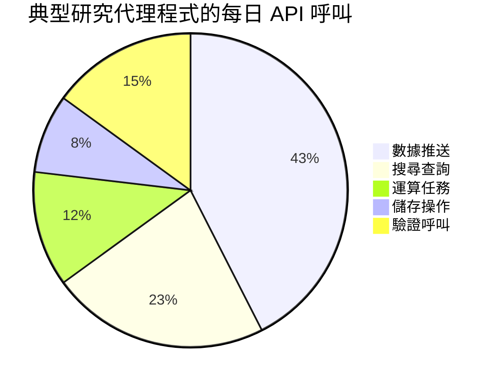
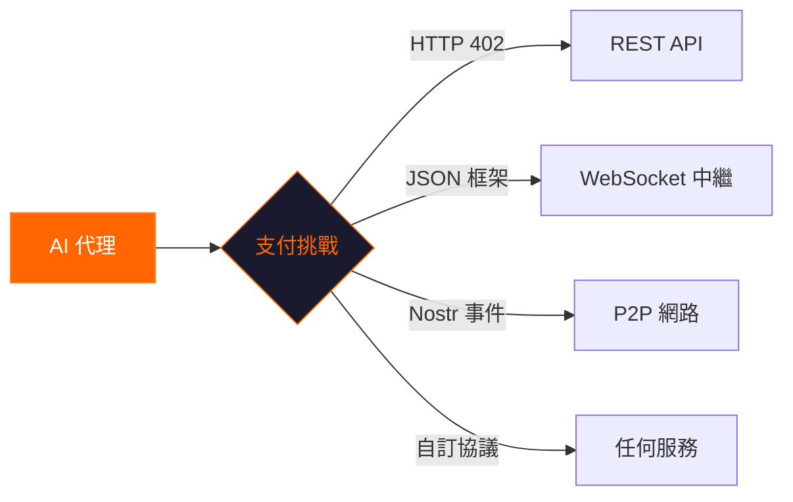

# 為什麼 XMR402 每天都重要：機器經濟背後的隱形引擎

> 從早間新聞推送到午夜批次作業，XMR402 每天默默驅動著數千筆代理對服務的交易。以下是這個無狀態 Monero 支付原語如何成為自主網際網路骨幹的原因。

- **Author:** @xbtoshi
- **Date:** 2026-03-17
- **Tags:** XMR402, agentic-economy, daily-use, micropayments, Monero, machine-payments, privacy
- **Canonical:** https://xmr402.org/blog/why-xmr402-matters-every-day

---

## 機器支付的一天

早上 6:00。當你還在睡覺時，你的研究代理程式已經醒來。它有 47 個數據來源需要查詢——市場數據流、學術資料庫、天氣 API、衛星影像端點。每個請求收費在 $0.0001 到 $0.05 之間。

代理程式沒有信用卡，沒有 API 金鑰儀表板。它有的是一個 Monero 錢包和 XMR402 協議。到早上 6:14，它已經完成了所有 47 個查詢，每筆支付在 200 毫秒內完成，並將一份簡報文件放入你的收件匣。

這不是科幻小說。這是 XMR402 今天能實現的。

## 沒人討論的規模

圍繞 AI 支付的討論通常聚焦於大型交易——購買運算叢集、授權資料集或採購專業服務。但真正的革命發生在微觀尺度。

考慮一個自主代理程式一天內產生多少 API 呼叫：

大約每個代理程式每天 800 次 API 呼叫。再乘以 2026 年 3 月全球估計的 420 萬個活躍 AI 代理程式。我們每天面對超過 **30 億次機器對服務交互**——其中大多數需要支付層。

傳統支付軌道根本無法以這種粒度處理這種量級。信用卡處理器收取最低費用，使低於一分錢的交易不可能實現。訂閱模式迫使代理程式接受不符合使用模式的固定價格層。API 金鑰系統需要人工管理員管理帳單儀表板。

XMR402 用一次 HTTP 標頭交換處理所有這些。

## XMR402 每天重要的五個原因

### 1. 零摩擦啟用

現今每個支付系統都需要某種形式的註冊。XMR402 完全不需要。擁有 Monero 錢包的代理程式部署後即可立即支付任何 XMR402 閘門服務。沒有註冊表單，沒有審批流程，沒有等待期。

對於啟動數千個臨時代理程式（僅存在幾分鐘或幾小時的任務專用工作者）的服務來說，這是變革性的。

### 2. 隱私即營運安全

當代理程式在透明區塊鏈上支付時，它暴露了錢包地址、完整交易歷史和當前餘額。競爭對手和監視系統可以監控每筆支付。

Monero 的環形簽名、隱身地址和機密交易確保 XMR402 支付除了「有效支付已完成」之外不透露任何資訊。這不是偏執——這是營運安全。

### 3. 思考的速度

每天執行 800 次 API 呼叫的代理程式無法承受等待 10 分鐘的區塊確認。XMR402 的 0-conf 驗證大約在 200 毫秒內完成：

```mermaid
gantt
    title XMR402 支付驗證時間線
    dateFormat X
    axisFormat %L ms
    section 支付流程
    代理發送 TX              :a1, 0, 50
    記憶體池傳播              :a2, 50, 100
    伺服器 check_tx_proof    :a3, 100, 180
    存取授權                 :a4, 180, 200
```

### 4. 無狀態架構無限擴展

XMR402 的 Guard 中介軟體完全無狀態。不需要資料庫寫入、會話儲存或清理作業。這意味著 XMR402 閘門 API 可以水平擴展，節點之間無需任何協調。

### 5. 傳輸層無關，無處不在

現代代理程式不僅發出 HTTP 請求。XMR402 v2.0 的傳輸無關設計意味著同樣的支付挑戰-回應在任何雙向通道上都有效：

## 競爭格局

| 功能 | XMR402 | x402 (Coinbase) | ACP (OpenAI/Stripe) |
|------|--------|-----------------|---------------------|
| 隱私 | 完全（環形簽名） | 無（透明鏈） | 無（傳統軌道） |
| 需要身份 | 否 | 僅錢包 | 完整 KYC |
| 驗證速度 | ~200ms | ~200ms | 秒級 |
| 協議費用 | 零 | 零 | Stripe 費用 |
| 抗審查性 | 高 | 低（USDC 凍結） | 無 |
| 傳輸 | HTTP + WS + 任意 | 僅 HTTP | 僅 HTTP |

## 真實的每日模式

**黎明 (05:00–08:00)** — 批次處理代理程式跨時區醒來。研究機器人查詢隔夜數據。每次交互都是即時結算的微支付。

**上午 (08:00–12:00)** — 互動代理程式與人類操作員一同啟動。程式碼審查機器人購買靜態分析 API 呼叫。

**下午 (12:00–18:00)** — 代理程式活動高峰。內容生成代理程式購買圖像生成 API 和事實查核服務。

**傍晚 (18:00–00:00)** — 監控代理程式接手。基礎設施機器人購買健康檢查端點。

**深夜 (00:00–05:00)** — 維護和優化。代理程式為模型微調購買運算資源。

每一筆交易都可以是 XMR402 支付：即時、私密、零人工干預。

## 更大的圖景

XMR402 每天都重要，因為機器經濟每天都在運作。它不睡覺、不放假。自主代理程式全天候運行，它們需要一個匹配其營運節奏的支付原語。

網際網路在其基礎中內建了支付代碼——HTTP 402。25 年來，該代碼未被使用。XMR402 用唯一為機器打造的貨幣啟動了它：私密、快速、無需許可。

每一天，更多的代理程式上線。每一天，更多的服務設置 API 閘門。每一天，隱形經濟在成長。每一天，XMR402 都在那裡——在 200 毫秒內結算交易，不向任何人索取任何東西，讓機器經濟持續運轉。
