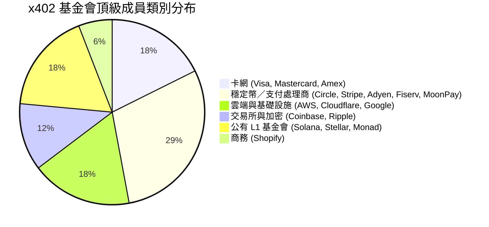
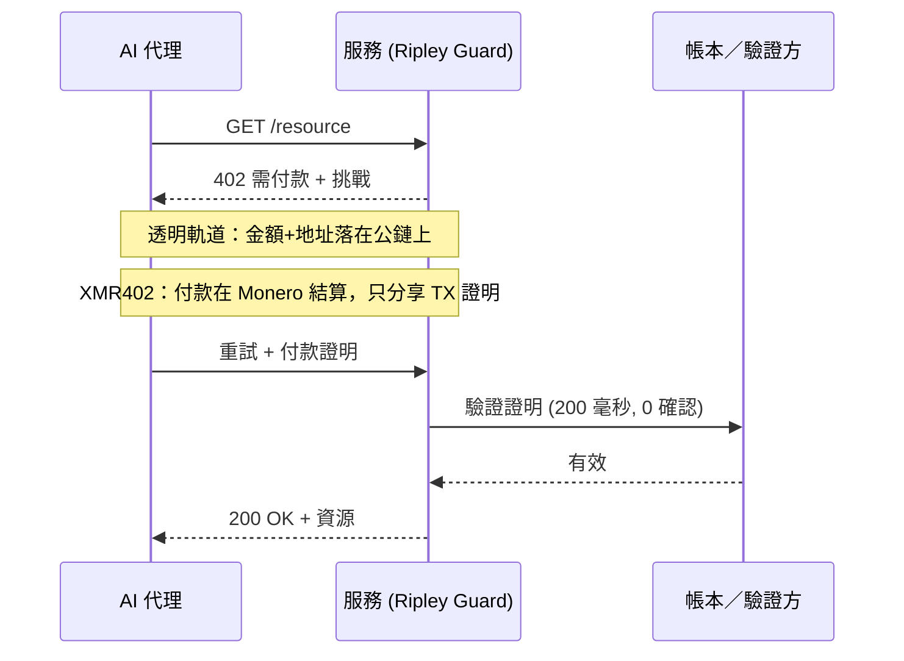

# 四十名成員，一本帳本：為什麼 x402 基金會的中立治理無法帶來中立的隱私

> x402 基金會於 7 月 14 日在 Linux 基金會下以 40 名成員啟動。但中立治理不等於中立隱私——只有 XMR402 在無人窺視之處結算代理付款。

- **Author:** @xbtoshi
- **Date:** 2026-07-20
- **Tags:** xmr402, monero, x402, x402-foundation, linux-foundation, agentic-payments, governance, privacy, stablecoin, visa, mastercard, stripe, coinbase, transparent-ledger, fcmp, anonymity-set, tx-proof, stateless, machine-payments, ripley-guard
- **Canonical:** https://xmr402.org/blog/x402-foundation-neutral-governance-transparent-ledger-xmr402

---

# 四十名成員，一本帳本：為什麼 x402 基金會的中立治理無法帶來中立的隱私

2026 年 7 月 14 日，x402 協定正式成熟。Linux 基金會宣布 **x402 基金會** 正式營運——這是一個由 40 個成員組織構成、供應商中立的開放治理機構，負責維護讓 AI 代理透過 HTTP 付款的標準。其頂級成員名單令人震撼：Adyen、AWS、American Express、Circle、Cloudflare、Coinbase、Fiserv、Google、Mastercard、Monad 基金會、MoonPay、Ripple、Shopify、Solana 基金會、Stellar 開發基金會、Stripe 以及 Visa。

對於一個 2025 年 5 月才作為 Coinbase 副項目起步的協定來說，這是規模化的正當性。Linux 基金會下的中立治理對互通性確實是好消息。但報導中正在發生一場悄然的偷換概念，而這很重要：**治理中立被當作付款中立來呈現。** 兩者並不相同。一個標準機構可以在「誰」能塑造協定這件事上做到完全公平，但協定本身在結構上仍然無法讓代理的付款保持私密。

這道鴻溝就是故事的全部。

## 「中立」真正治理的是什麼

開放治理意味著沒有任何一家公司擁有規範。Coinbase 貢獻了 x402，但今後其演進將公開決定，每位頂級成員都有一席之地。這是真實而有價值的特性，它解決了一個政治問題：擔心某一家供應商會壟斷機器經濟賴以運行的支付軌道。

但它沒有解決的是資料問題。x402 核心是一種傳輸約定——HTTP 402 挑戰、付款負載、驗證步驟。任何一筆付款的隱私特性幾乎完全來自底層的 *結算層*，而非上層的治理章程。而頂級成員帶來的結算層無一例外都是預設透明或綁定身分的：與你法定姓名綁定的卡網、每筆轉帳都成為永久記錄的公鏈穩定幣、以掌握資金流向為商業模式的雲端供應商。

你可以用世界上最平衡的委員會來治理一本透明帳本。它依然是一本透明帳本。

看看這個組成。十七個頂級成員中有十四個，其核心價值都依賴於「看見」交易——為其定價風險、清算、索引，或在任何人都能讀取的鏈上結算。這不是對任一成員的批評，而是對誘因的觀察。一個由以交易可見性獲利的機構組成的治理機構，不會將預設值導向交易的不可見。它沒有理由這麼做。

## 預設透明是設計選擇，而非自然法則

想想當代理透過主流 x402 軌道、以公鏈穩定幣結算來為服務付款時實際發生了什麼。金額、時間、付款地址與收款地址全都寫入一本永不遺忘的帳本。鏈上分析公司早已從這些資料重建行為。當付款方是每天進行數千筆小額購買的自主代理時，這條軌跡不只是一筆交易的記錄——它是一張高解析度的策略地圖：代理依賴哪些 API、多久呼叫一次、一個工作負載成本多少、需求何時激增。

無論用哪條軌道，x402 的機制都很優雅。差別在於洩漏什麼。在透明結算層上，驗證方——以及全世界——得知的遠不止「這個代理付了款」。在隱私保護層上，驗證方只得知一件事：付款有效。

## XMR402 的位置

XMR402 是同一個開放 x402 理念的 Monero 原生實作。它使用完全相同的 HTTP 402 語法，因此與基金會現在維護的標準相容。改變的是底層基質。結算在 Monero 上進行，伺服器並非透過觀察公鏈來確信，而是透過一份 **Monero 交易證明**——一張密碼學收據，證明某筆特定付款已支付至某個特定地址，可在約 200 毫秒、0 確認下驗證，且不會向任何第三方暴露金額或可花費歷史。

這不是外掛式的隱私功能。它是預設值，並繼承了 Monero 在 2026 年 7 月的態勢：FCMP++ 升級後，每筆花費都針對超過 1.5 億個輸出的匿名集進行證明，而過去只有 16 個環成員。這份隱私不是委員會下季可以投票削弱的政策，而是密碼學的屬性。

| 面向 | x402 基金會技術棧（典型軌道） | XMR402 |
|---|---|---|
| 治理 | 40 名成員的 Linux 基金會機構 | 開放協定，Monero 原生 |
| 預設結算 | 公鏈／卡網 | Monero（預設私密） |
| 驗證方看到什麼 | 金額、地址、時間 | 僅「付款有效」（TX 證明） |
| 匿名集 | 地址層級透明 | 1.5 億+ 輸出 (FCMP++) |
| 協定費用 | 依軌道／處理商而異 | 零 |
| 確認模型 | 依鏈而定 | 透過 TX 證明 200 毫秒 0 確認 |
| 資料排放 | 永久公開軌跡 | 除證明外無 |

## 中立是必要，而非充分

這一切都無損 x402 基金會的成就。中立標準是健康機器經濟的先決條件，支付領域最重要的四十家公司同意公開建設是真正的里程碑。重點更狹窄也更鋒利：治理中立與 *觀察* 中立是不同的保證，而 7 月 14 日只推出了其中一個。

每天付款一千次的代理不需要委員會承諾公平對待。它需要一條軌道，讓它的付款不會成為一份資料集。基金會給了生態系第一個。XMR402 的存在是為了給它第二個——相同的 402 握手，在無人窺視之處結算。網際網路早已學過這一課：我們不是靠成立委員會治理誰能讀取流量來讓網路可信，而是靠加密流量讓那個問題不再重要。代理的付款隱私是同一步棋，只是低一層。治理決定誰掌舵；密碼學決定誰能看見。對於每天處理數百萬筆付款的機器經濟而言，第二個問題才是讓你保持自由的那個。
