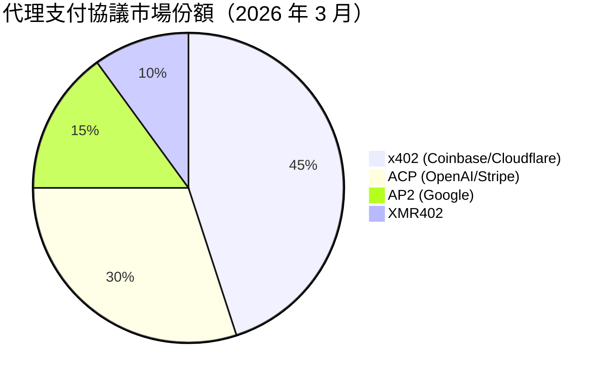
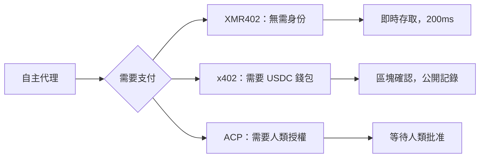

# XMR402 對決代理支付協議群：逐一協議深度比較

> 代理支付主導權的競賽已經開始。x402（Coinbase）、ACP（OpenAI/Stripe）和 AP2（Google）都在競爭 AI 原生支付。本文深度比較 XMR402 如何應對，以及為何隱私性與無狀態架構改變了一切。

- **Author:** @xbtoshi
- **Date:** 2026-03-18
- **Tags:** protocol-comparison, x402, ACP, agentic-payments, Monero, XMR402, privacy, stablecoins
- **Canonical:** https://xmr402.org/blog/xmr402-vs-agentic-payment-protocols

---

## 協議大戰已經開始

2026 年初，科技界發生了一件不同尋常的事：三家最具影響力的科技公司幾乎同時宣布了各自的代理支付標準。Coinbase 聯合 Cloudflare 啟動了 x402 基金會；OpenAI 和 Stripe 共同發布了代理商務協議（ACP），為 ChatGPT 即時結帳提供支持；Google 則推出了自己的代理支付協議 AP2。

訊息很明確：AI 代理支付是下一個互聯網基礎設施前沿，每個主要平台都想佔據這個層次。

## 四大協議概覽

### x402（Coinbase + Cloudflare）

x402 使用 HTTP 402 作為傳輸機制，在以太坊相容鏈上使用 USDC 等穩定幣結算。擁有 Coinbase 開發者平台和 Cloudflare 全球 CDN 的龐大分發優勢。

**解決了什麼：** 代理程式與服務之間的微支付，費用低於傳統信用卡。

**沒有解決什麼：** USDC 嵌入了 KYC；公開帳本使所有代理交易永久可見；不真正無狀態。

### ACP — 代理商務協議（OpenAI + Stripe）

ACP 為*人類發起的*商務通過 AI 代理設計。透過共享支付令牌（SPT），人類授權後可在不暴露信用卡資料的情況下完成交易。

**解決了什麼：** 在 AI 介面中的消費者結帳。**沒有解決什麼：** 必須依賴人類授權，無法真正支持自主機器對機器支付。

### AP2（Google）

AP2 是複雜代理工作流的編排層，整合 x402 作為穩定幣支付層，繼承了 x402 的架構及其限制。

### XMR402（Monero 原生）

XMR402 使用相同的 HTTP 402 機制，但在 Monero 上結算——唯一具有強制協議級隱私的主要加密貨幣。通過 TX Proof 實現 200ms 的零確認驗證，完全無狀態，無需身份。

## 協議比較表

| 功能 | XMR402 | x402 (Coinbase) | ACP (OpenAI/Stripe) | AP2 (Google) |
|---|---|---|---|---|
| **隱私** | 完整（RingCT）| 無（公開鏈）| 無（Stripe KYC）| 無（公開鏈）|
| **需要 KYC** | 否 | USDC 錢包 KYC | 需要信用卡 | 錢包 KYC |
| **需要人類** | 否 | 否 | 是 | 部分 |
| **驗證速度** | ~200ms | 區塊確認 | API 往返 | API 往返 |
| **協議費用** | 0 | Gas 費用 | Stripe 費率 | Gas 費用 |
| **抗審查** | 是 | 否 | 否 | 否 |

## 根本的設計問題

XMR402 是唯一一個代理程式可以在**完全沒有受 KYC 控制的身份介入**的情況下運作的協議。每一個其他協議至少依賴一個 KYC 實體——USDC 錢包、Stripe 帳戶或信用卡。

就企業關注度和媒體報導而言，XMR402 面對的是巨頭的競爭。但在長期的代理支付生態中，最終獲勝的協議將是自主代理真正能用的——無需許可，無需身份，數學保障隱私。

## 隱私論點不會消失

每個累積了金融交易數據的主要互聯網平台，最終都將其用於競爭優勢或監管槓桿。公開區塊鏈支付記錄更加暴露——永久、不可變、任何人都可查詢。

XMR402 是唯一預設使此數據不可見的協議。不是靠政策，不是靠服務條款，而是靠數學。
